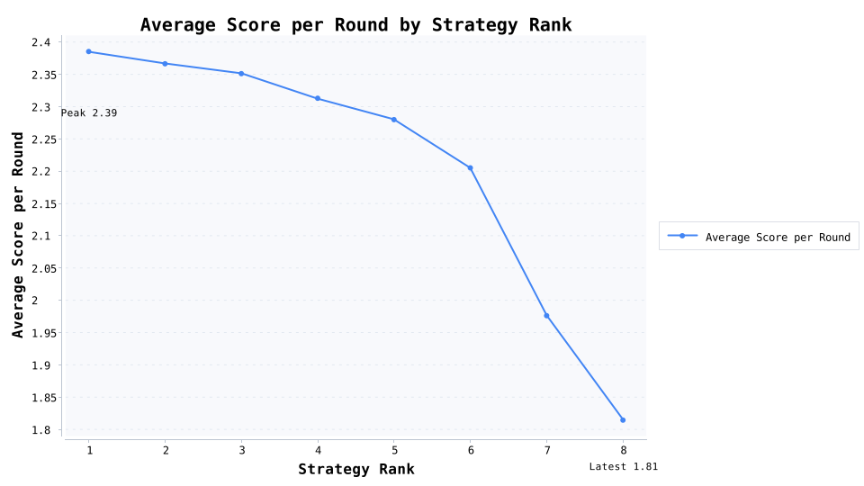

# 协同的进化：重复囚徒困境的锦标赛观察

实验设定：在含 1.5% 噪声的环境中进行 200 轮重复囚徒困境，对局支付矩阵为 R=3、T=5、P=1、S=0；每种策略投放 12 名角色，随机匹配 30 轮以确保参赛次数一致。

参赛策略与行为解读：

· 永远合作：无条件合作，代表极端的信任型角色。

· 永远背叛：无条件背叛，体现完全自利与防御的角色。

· 以牙还牙：先合作，再复刻对手上一轮动作的经典互惠策略。

· 宽容版以牙还牙：在对手背叛后以 30% 概率原谅，避免报复循环。

· 严厉惩罚者：初始合作，但一旦发现背叛就永久惩罚。

· 赢则守输则换：上一轮赢则保持动作，未赢则切换，代表经验主义角色。

· 怀疑型以牙还牙：首轮先试探性背叛，再复制对手上一轮动作。

· 随机触发以牙还牙：复刻对手动作，但以 20% 概率主动合作，模拟冲动友善。

角色排行榜（共 96 名角色，全部结果如下）：

· 第 1 名 宽容版以牙还牙#2（宽容版以牙还牙） —— 每场累计得分 543.73（折合每轮 2.719），合作率 87.8%、背叛率 12.2%，互惠率 78.7%，最好/最差比赛得分 601.00 / 152.00，参与对局 30 场（得分标准差 115.59）。

· 第 2 名 永远合作#10（永远合作） —— 每场累计得分 519.97（折合每轮 2.600），合作率 98.8%、背叛率 1.2%，互惠率 84.9%，最好/最差比赛得分 598.00 / 12.00，参与对局 30 场（得分标准差 167.06）。

· 第 3 名 随机触发以牙还牙#6（随机触发以牙还牙） —— 每场累计得分 515.17（折合每轮 2.576），合作率 81.2%、背叛率 18.8%，互惠率 72.0%，最好/最差比赛得分 608.00 / 156.00，参与对局 30 场（得分标准差 155.03）。

· 第 4 名 随机触发以牙还牙#10（随机触发以牙还牙） —— 每场累计得分 513.93（折合每轮 2.570），合作率 80.4%、背叛率 19.6%，互惠率 70.1%，最好/最差比赛得分 611.00 / 157.00，参与对局 30 场（得分标准差 146.97）。

· 第 5 名 永远合作#12（永远合作） —— 每场累计得分 504.37（折合每轮 2.522），合作率 98.7%、背叛率 1.3%，互惠率 82.2%，最好/最差比赛得分 602.00 / 3.00，参与对局 30 场（得分标准差 190.44）。

· 第 6 名 永远合作#7（永远合作） —— 每场累计得分 503.97（折合每轮 2.520），合作率 98.3%、背叛率 1.7%，互惠率 81.5%，最好/最差比赛得分 603.00 / 15.00，参与对局 30 场（得分标准差 177.89）。

· 第 7 名 随机触发以牙还牙#2（随机触发以牙还牙） —— 每场累计得分 501.33（折合每轮 2.507），合作率 77.2%、背叛率 22.8%，互惠率 66.2%，最好/最差比赛得分 614.00 / 173.00，参与对局 30 场（得分标准差 151.80）。

· 第 8 名 赢则守输则换#5（赢则守输则换） —— 每场累计得分 497.17（折合每轮 2.486），合作率 66.2%、背叛率 33.8%，互惠率 50.8%，最好/最差比赛得分 610.00 / 203.00，参与对局 30 场（得分标准差 121.82）。

· 第 9 名 宽容版以牙还牙#7（宽容版以牙还牙） —— 每场累计得分 496.67（折合每轮 2.483），合作率 81.3%、背叛率 18.7%，互惠率 69.7%，最好/最差比赛得分 603.00 / 136.00，参与对局 30 场（得分标准差 166.96）。

· 第 10 名 赢则守输则换#12（赢则守输则换） —— 每场累计得分 494.03（折合每轮 2.470），合作率 68.1%、背叛率 31.9%，互惠率 57.5%，最好/最差比赛得分 603.00 / 197.00，参与对局 30 场（得分标准差 140.47）。

· 第 11 名 宽容版以牙还牙#10（宽容版以牙还牙） —— 每场累计得分 492.33（折合每轮 2.462），合作率 80.9%、背叛率 19.1%，互惠率 68.5%，最好/最差比赛得分 611.00 / 133.00，参与对局 30 场（得分标准差 169.88）。

· 第 12 名 以牙还牙#9（以牙还牙） —— 每场累计得分 492.00（折合每轮 2.460），合作率 65.2%、背叛率 34.8%，互惠率 50.3%，最好/最差比赛得分 608.00 / 202.00，参与对局 30 场（得分标准差 125.45）。

· 第 13 名 永远合作#6（永远合作） —— 每场累计得分 489.50（折合每轮 2.448），合作率 98.5%、背叛率 1.5%，互惠率 79.5%，最好/最差比赛得分 603.00 / 5.00，参与对局 30 场（得分标准差 204.68）。

· 第 14 名 宽容版以牙还牙#5（宽容版以牙还牙） —— 每场累计得分 489.10（折合每轮 2.446），合作率 81.2%、背叛率 18.8%，互惠率 69.9%，最好/最差比赛得分 606.00 / 142.00，参与对局 30 场（得分标准差 174.27）。

· 第 15 名 随机触发以牙还牙#1（随机触发以牙还牙） —— 每场累计得分 488.90（折合每轮 2.444），合作率 76.4%、背叛率 23.6%，互惠率 65.5%，最好/最差比赛得分 602.00 / 158.00，参与对局 30 场（得分标准差 162.22）。

· 第 16 名 宽容版以牙还牙#1（宽容版以牙还牙） —— 每场累计得分 488.23（折合每轮 2.441），合作率 80.5%、背叛率 19.5%，互惠率 68.4%，最好/最差比赛得分 604.00 / 133.00，参与对局 30 场（得分标准差 167.33）。

· 第 17 名 以牙还牙#4（以牙还牙） —— 每场累计得分 487.90（折合每轮 2.440），合作率 66.1%、背叛率 33.9%，互惠率 54.5%，最好/最差比赛得分 611.00 / 196.00，参与对局 30 场（得分标准差 121.06）。

· 第 18 名 随机触发以牙还牙#3（随机触发以牙还牙） —— 每场累计得分 485.67（折合每轮 2.428），合作率 75.9%、背叛率 24.1%，互惠率 65.8%，最好/最差比赛得分 603.00 / 163.00，参与对局 30 场（得分标准差 173.46）。

· 第 19 名 宽容版以牙还牙#4（宽容版以牙还牙） —— 每场累计得分 484.93（折合每轮 2.425），合作率 80.6%、背叛率 19.4%，互惠率 69.6%，最好/最差比赛得分 605.00 / 139.00，参与对局 30 场（得分标准差 183.90）。

· 第 20 名 永远合作#11（永远合作） —— 每场累计得分 484.90（折合每轮 2.425），合作率 98.4%、背叛率 1.6%，互惠率 78.6%，最好/最差比赛得分 598.00 / 19.00，参与对局 30 场（得分标准差 180.36）。

· 第 21 名 随机触发以牙还牙#8（随机触发以牙还牙） —— 每场累计得分 483.93（折合每轮 2.420），合作率 75.2%、背叛率 24.8%，互惠率 63.9%，最好/最差比赛得分 606.00 / 145.00，参与对局 30 场（得分标准差 174.04）。

· 第 22 名 赢则守输则换#6（赢则守输则换） —— 每场累计得分 479.27（折合每轮 2.396），合作率 63.7%、背叛率 36.3%，互惠率 52.3%，最好/最差比赛得分 601.00 / 211.00，参与对局 30 场（得分标准差 123.32）。

· 第 23 名 怀疑型以牙还牙#1（怀疑型以牙还牙） —— 每场累计得分 477.83（折合每轮 2.389），合作率 60.9%、背叛率 39.1%，互惠率 47.1%，最好/最差比赛得分 600.00 / 198.00，参与对局 30 场（得分标准差 134.64）。

· 第 24 名 赢则守输则换#10（赢则守输则换） —— 每场累计得分 476.27（折合每轮 2.381），合作率 63.3%、背叛率 36.7%，互惠率 51.8%，最好/最差比赛得分 605.00 / 205.00，参与对局 30 场（得分标准差 137.14）。

· 第 25 名 以牙还牙#11（以牙还牙） —— 每场累计得分 474.60（折合每轮 2.373），合作率 60.3%、背叛率 39.7%，互惠率 45.0%，最好/最差比赛得分 610.00 / 198.00，参与对局 30 场（得分标准差 132.79）。

· 第 26 名 宽容版以牙还牙#3（宽容版以牙还牙） —— 每场累计得分 472.60（折合每轮 2.363），合作率 77.8%、背叛率 22.2%，互惠率 65.4%，最好/最差比赛得分 608.00 / 133.00，参与对局 30 场（得分标准差 177.00）。

· 第 27 名 赢则守输则换#8（赢则守输则换） —— 每场累计得分 471.80（折合每轮 2.359），合作率 60.6%、背叛率 39.4%，互惠率 46.3%，最好/最差比赛得分 606.00 / 200.00，参与对局 30 场（得分标准差 127.15）。

· 第 28 名 赢则守输则换#4（赢则守输则换） —— 每场累计得分 471.53（折合每轮 2.358），合作率 60.5%、背叛率 39.5%，互惠率 46.4%，最好/最差比赛得分 611.00 / 198.00，参与对局 30 场（得分标准差 130.84）。

· 第 29 名 怀疑型以牙还牙#10（怀疑型以牙还牙） —— 每场累计得分 471.40（折合每轮 2.357），合作率 56.7%、背叛率 43.3%，互惠率 37.1%，最好/最差比赛得分 609.00 / 205.00，参与对局 30 场（得分标准差 119.18）。

· 第 30 名 随机触发以牙还牙#4（随机触发以牙还牙） —— 每场累计得分 470.90（折合每轮 2.355），合作率 74.5%、背叛率 25.5%，互惠率 64.2%，最好/最差比赛得分 610.00 / 156.00，参与对局 30 场（得分标准差 179.32）。

· 第 31 名 赢则守输则换#3（赢则守输则换） —— 每场累计得分 470.30（折合每轮 2.352），合作率 60.1%、背叛率 39.9%，互惠率 45.7%，最好/最差比赛得分 608.00 / 203.00，参与对局 30 场（得分标准差 113.45）。

· 第 32 名 以牙还牙#2（以牙还牙） —— 每场累计得分 469.90（折合每轮 2.350），合作率 62.4%、背叛率 37.6%，互惠率 53.3%，最好/最差比赛得分 603.00 / 202.00，参与对局 30 场（得分标准差 156.47）。

· 第 33 名 永远合作#1（永远合作） —— 每场累计得分 469.30（折合每轮 2.347），合作率 98.3%、背叛率 1.7%，互惠率 75.9%，最好/最差比赛得分 600.00 / 4.00，参与对局 30 场（得分标准差 214.08）。

· 第 34 名 怀疑型以牙还牙#6（怀疑型以牙还牙） —— 每场累计得分 468.70（折合每轮 2.344），合作率 59.4%、背叛率 40.7%，互惠率 45.9%，最好/最差比赛得分 610.00 / 196.00，参与对局 30 场（得分标准差 148.50）。

· 第 35 名 宽容版以牙还牙#8（宽容版以牙还牙） —— 每场累计得分 466.40（折合每轮 2.332），合作率 77.4%、背叛率 22.6%，互惠率 65.5%，最好/最差比赛得分 615.00 / 135.00，参与对局 30 场（得分标准差 186.19）。

· 第 36 名 赢则守输则换#11（赢则守输则换） —— 每场累计得分 466.10（折合每轮 2.331），合作率 60.7%、背叛率 39.3%，互惠率 48.8%，最好/最差比赛得分 609.00 / 196.00，参与对局 30 场（得分标准差 143.15）。

· 第 37 名 怀疑型以牙还牙#4（怀疑型以牙还牙） —— 每场累计得分 465.43（折合每轮 2.327），合作率 59.8%、背叛率 40.2%，互惠率 49.6%，最好/最差比赛得分 606.00 / 201.00，参与对局 30 场（得分标准差 160.03）。

· 第 38 名 随机触发以牙还牙#7（随机触发以牙还牙） —— 每场累计得分 464.70（折合每轮 2.324），合作率 71.0%、背叛率 29.0%，互惠率 58.4%，最好/最差比赛得分 604.00 / 161.00，参与对局 30 场（得分标准差 178.86）。

· 第 39 名 严厉惩罚者#1（严厉惩罚者） —— 每场累计得分 464.57（折合每轮 2.323），合作率 18.9%、背叛率 81.1%，互惠率 17.7%，最好/最差比赛得分 959.00 / 197.00，参与对局 30 场（得分标准差 269.80）。

· 第 40 名 永远合作#5（永远合作） —— 每场累计得分 461.87（折合每轮 2.309），合作率 98.1%、背叛率 1.9%，互惠率 74.5%，最好/最差比赛得分 611.00 / 9.00，参与对局 30 场（得分标准差 233.51）。

· 第 41 名 赢则守输则换#2（赢则守输则换） —— 每场累计得分 460.73（折合每轮 2.304），合作率 60.2%、背叛率 39.8%，互惠率 50.6%，最好/最差比赛得分 608.00 / 199.00，参与对局 30 场（得分标准差 154.98）。

· 第 42 名 赢则守输则换#7（赢则守输则换） —— 每场累计得分 460.47（折合每轮 2.302），合作率 58.3%、背叛率 41.7%，互惠率 44.2%，最好/最差比赛得分 608.00 / 200.00，参与对局 30 场（得分标准差 146.52）。

· 第 43 名 严厉惩罚者#3（严厉惩罚者） —— 每场累计得分 457.93（折合每轮 2.290），合作率 19.8%、背叛率 80.2%，互惠率 18.7%，最好/最差比赛得分 967.00 / 206.00，参与对局 30 场（得分标准差 250.24）。

· 第 44 名 宽容版以牙还牙#6（宽容版以牙还牙） —— 每场累计得分 456.80（折合每轮 2.284），合作率 76.4%、背叛率 23.6%，互惠率 62.3%，最好/最差比赛得分 611.00 / 136.00，参与对局 30 场（得分标准差 183.00）。

· 第 45 名 随机触发以牙还牙#12（随机触发以牙还牙） —— 每场累计得分 454.63（折合每轮 2.273），合作率 69.7%、背叛率 30.3%，互惠率 57.2%，最好/最差比赛得分 609.00 / 159.00，参与对局 30 场（得分标准差 184.85）。

· 第 46 名 以牙还牙#3（以牙还牙） —— 每场累计得分 452.83（折合每轮 2.264），合作率 57.3%、背叛率 42.7%，互惠率 46.1%，最好/最差比赛得分 609.00 / 199.00，参与对局 30 场（得分标准差 153.32）。

· 第 47 名 怀疑型以牙还牙#12（怀疑型以牙还牙） —— 每场累计得分 451.57（折合每轮 2.258），合作率 55.8%、背叛率 44.2%，互惠率 43.3%，最好/最差比赛得分 609.00 / 202.00，参与对局 30 场（得分标准差 151.52）。

· 第 48 名 永远背叛#3（永远背叛） —— 每场累计得分 451.07（折合每轮 2.255），合作率 1.2%、背叛率 98.8%，互惠率 0.3%，最好/最差比赛得分 998.00 / 202.00，参与对局 30 场（得分标准差 307.86）。

· 第 49 名 以牙还牙#12（以牙还牙） —— 每场累计得分 451.07（折合每轮 2.255），合作率 57.3%、背叛率 42.7%，互惠率 45.9%，最好/最差比赛得分 616.00 / 203.00，参与对局 30 场（得分标准差 166.12）。

· 第 50 名 宽容版以牙还牙#12（宽容版以牙还牙） —— 每场累计得分 449.50（折合每轮 2.248），合作率 75.9%、背叛率 24.1%，互惠率 62.1%，最好/最差比赛得分 609.00 / 133.00，参与对局 30 场（得分标准差 199.79）。

· 第 51 名 永远合作#9（永远合作） —— 每场累计得分 448.43（折合每轮 2.242），合作率 98.4%、背叛率 1.6%，互惠率 72.7%，最好/最差比赛得分 602.00 / 6.00，参与对局 30 场（得分标准差 225.75）。

· 第 52 名 赢则守输则换#1（赢则守输则换） —— 每场累计得分 447.77（折合每轮 2.239），合作率 55.9%、背叛率 44.1%，互惠率 43.8%，最好/最差比赛得分 607.00 / 200.00，参与对局 30 场（得分标准差 152.81）。

· 第 53 名 赢则守输则换#9（赢则守输则换） —— 每场累计得分 447.57（折合每轮 2.238），合作率 55.9%、背叛率 44.1%，互惠率 42.6%，最好/最差比赛得分 604.00 / 204.00，参与对局 30 场（得分标准差 151.18）。

· 第 54 名 怀疑型以牙还牙#5（怀疑型以牙还牙） —— 每场累计得分 447.57（折合每轮 2.238），合作率 53.5%、背叛率 46.5%，互惠率 38.0%，最好/最差比赛得分 610.00 / 197.00，参与对局 30 场（得分标准差 142.14）。

· 第 55 名 以牙还牙#10（以牙还牙） —— 每场累计得分 446.40（折合每轮 2.232），合作率 56.9%、背叛率 43.1%，互惠率 47.6%，最好/最差比赛得分 605.00 / 201.00，参与对局 30 场（得分标准差 157.97）。

· 第 56 名 以牙还牙#6（以牙还牙） —— 每场累计得分 445.60（折合每轮 2.228），合作率 56.4%、背叛率 43.6%，互惠率 46.0%，最好/最差比赛得分 602.00 / 200.00，参与对局 30 场（得分标准差 142.27）。

· 第 57 名 宽容版以牙还牙#9（宽容版以牙还牙） —— 每场累计得分 444.67（折合每轮 2.223），合作率 75.1%、背叛率 24.9%，互惠率 61.6%，最好/最差比赛得分 604.00 / 133.00，参与对局 30 场（得分标准差 196.46）。

· 第 58 名 随机触发以牙还牙#9（随机触发以牙还牙） —— 每场累计得分 442.10（折合每轮 2.211），合作率 69.7%、背叛率 30.3%，互惠率 56.8%，最好/最差比赛得分 606.00 / 158.00，参与对局 30 场（得分标准差 190.98）。

· 第 59 名 永远合作#3（永远合作） —— 每场累计得分 441.63（折合每轮 2.208），合作率 98.6%、背叛率 1.4%，互惠率 71.8%，最好/最差比赛得分 608.00 / 3.00，参与对局 30 场（得分标准差 229.42）。

· 第 60 名 以牙还牙#1（以牙还牙） —— 每场累计得分 440.90（折合每轮 2.205），合作率 53.4%、背叛率 46.6%，互惠率 39.6%，最好/最差比赛得分 605.00 / 197.00，参与对局 30 场（得分标准差 142.08）。

· 第 61 名 宽容版以牙还牙#11（宽容版以牙还牙） —— 每场累计得分 440.20（折合每轮 2.201），合作率 73.7%、背叛率 26.3%，互惠率 59.7%，最好/最差比赛得分 605.00 / 139.00，参与对局 30 场（得分标准差 204.62）。

· 第 62 名 以牙还牙#5（以牙还牙） —— 每场累计得分 438.50（折合每轮 2.193），合作率 53.3%、背叛率 46.7%，互惠率 39.6%，最好/最差比赛得分 605.00 / 195.00，参与对局 30 场（得分标准差 148.09）。

· 第 63 名 以牙还牙#8（以牙还牙） —— 每场累计得分 438.20（折合每轮 2.191），合作率 53.8%、背叛率 46.2%，互惠率 40.7%，最好/最差比赛得分 611.00 / 198.00，参与对局 30 场（得分标准差 147.11）。

· 第 64 名 怀疑型以牙还牙#2（怀疑型以牙还牙） —— 每场累计得分 438.07（折合每轮 2.190），合作率 53.1%、背叛率 46.9%，互惠率 41.4%，最好/最差比赛得分 614.00 / 196.00，参与对局 30 场（得分标准差 158.30）。

· 第 65 名 严厉惩罚者#7（严厉惩罚者） —— 每场累计得分 437.77（折合每轮 2.189），合作率 21.1%、背叛率 78.9%，互惠率 19.6%，最好/最差比赛得分 929.00 / 201.00，参与对局 30 场（得分标准差 220.83）。

· 第 66 名 怀疑型以牙还牙#7（怀疑型以牙还牙） —— 每场累计得分 437.63（折合每轮 2.188），合作率 51.1%、背叛率 48.9%，互惠率 35.5%，最好/最差比赛得分 604.00 / 206.00，参与对局 30 场（得分标准差 140.24）。

· 第 67 名 怀疑型以牙还牙#11（怀疑型以牙还牙） —— 每场累计得分 436.20（折合每轮 2.181），合作率 51.7%、背叛率 48.3%，互惠率 39.0%，最好/最差比赛得分 609.00 / 202.00，参与对局 30 场（得分标准差 159.25）。

· 第 68 名 以牙还牙#7（以牙还牙） —— 每场累计得分 434.07（折合每轮 2.170），合作率 53.3%、背叛率 46.7%，互惠率 41.7%，最好/最差比赛得分 602.00 / 197.00，参与对局 30 场（得分标准差 155.80）。

· 第 69 名 随机触发以牙还牙#11（随机触发以牙还牙） —— 每场累计得分 429.47（折合每轮 2.147），合作率 66.3%、背叛率 33.7%，互惠率 53.0%，最好/最差比赛得分 607.00 / 149.00，参与对局 30 场（得分标准差 192.90）。

· 第 70 名 随机触发以牙还牙#5（随机触发以牙还牙） —— 每场累计得分 428.90（折合每轮 2.145），合作率 65.6%、背叛率 34.4%，互惠率 51.9%，最好/最差比赛得分 610.00 / 154.00，参与对局 30 场（得分标准差 193.78）。

· 第 71 名 永远背叛#7（永远背叛） —— 每场累计得分 425.67（折合每轮 2.128），合作率 1.3%、背叛率 98.7%，互惠率 0.3%，最好/最差比赛得分 986.00 / 207.00，参与对局 30 场（得分标准差 268.55）。

· 第 72 名 永远背叛#1（永远背叛） —— 每场累计得分 420.90（折合每轮 2.105），合作率 1.8%、背叛率 98.2%，互惠率 0.5%，最好/最差比赛得分 990.00 / 205.00，参与对局 30 场（得分标准差 269.85）。

· 第 73 名 永远合作#2（永远合作） —— 每场累计得分 420.30（折合每轮 2.102），合作率 98.5%、背叛率 1.5%，互惠率 68.0%，最好/最差比赛得分 601.00 / 6.00，参与对局 30 场（得分标准差 259.88）。

· 第 74 名 严厉惩罚者#10（严厉惩罚者） —— 每场累计得分 414.77（折合每轮 2.074），合作率 13.2%、背叛率 86.8%，互惠率 11.6%，最好/最差比赛得分 955.00 / 200.00，参与对局 30 场（得分标准差 240.73）。

· 第 75 名 永远合作#8（永远合作） —— 每场累计得分 412.87（折合每轮 2.064），合作率 98.6%、背叛率 1.4%，互惠率 67.2%，最好/最差比赛得分 600.00 / 6.00，参与对局 30 场（得分标准差 241.22）。

· 第 76 名 怀疑型以牙还牙#8（怀疑型以牙还牙） —— 每场累计得分 411.70（折合每轮 2.059），合作率 47.1%、背叛率 52.9%，互惠率 35.7%，最好/最差比赛得分 607.00 / 194.00，参与对局 30 场（得分标准差 157.18）。

· 第 77 名 严厉惩罚者#2（严厉惩罚者） —— 每场累计得分 408.23（折合每轮 2.041），合作率 14.9%、背叛率 85.1%，互惠率 13.3%，最好/最差比赛得分 917.00 / 201.00，参与对局 30 场（得分标准差 231.14）。

· 第 78 名 永远背叛#11（永远背叛） —— 每场累计得分 408.17（折合每轮 2.041），合作率 1.5%、背叛率 98.5%，互惠率 0.4%，最好/最差比赛得分 990.00 / 200.00，参与对局 30 场（得分标准差 272.07）。

· 第 79 名 严厉惩罚者#5（严厉惩罚者） —— 每场累计得分 407.67（折合每轮 2.038），合作率 14.9%、背叛率 85.1%，互惠率 13.3%，最好/最差比赛得分 919.00 / 198.00，参与对局 30 场（得分标准差 248.55）。

· 第 80 名 怀疑型以牙还牙#9（怀疑型以牙还牙） —— 每场累计得分 400.73（折合每轮 2.004），合作率 44.7%、背叛率 55.3%，互惠率 33.2%，最好/最差比赛得分 599.00 / 199.00，参与对局 30 场（得分标准差 162.40）。

· 第 81 名 永远背叛#12（永远背叛） —— 每场累计得分 397.20（折合每轮 1.986），合作率 1.3%、背叛率 98.8%，互惠率 0.3%，最好/最差比赛得分 998.00 / 202.00，参与对局 30 场（得分标准差 251.05）。

· 第 82 名 永远合作#4（永远合作） —— 每场累计得分 394.30（折合每轮 1.972），合作率 98.2%、背叛率 1.8%，互惠率 63.5%，最好/最差比赛得分 599.00 / 3.00，参与对局 30 场（得分标准差 249.47）。

· 第 83 名 严厉惩罚者#12（严厉惩罚者） —— 每场累计得分 387.23（折合每轮 1.936），合作率 20.3%、背叛率 79.7%，互惠率 18.7%，最好/最差比赛得分 955.00 / 203.00，参与对局 30 场（得分标准差 204.08）。

· 第 84 名 怀疑型以牙还牙#3（怀疑型以牙还牙） —— 每场累计得分 385.83（折合每轮 1.929），合作率 38.7%、背叛率 61.3%，互惠率 23.1%，最好/最差比赛得分 608.00 / 203.00，参与对局 30 场（得分标准差 145.69）。

· 第 85 名 严厉惩罚者#6（严厉惩罚者） —— 每场累计得分 373.60（折合每轮 1.868），合作率 16.3%、背叛率 83.7%，互惠率 15.0%，最好/最差比赛得分 937.00 / 208.00，参与对局 30 场（得分标准差 185.73）。

· 第 86 名 永远背叛#8（永远背叛） —— 每场累计得分 369.27（折合每轮 1.846），合作率 1.5%、背叛率 98.5%，互惠率 0.4%，最好/最差比赛得分 988.00 / 205.00，参与对局 30 场（得分标准差 255.01）。

· 第 87 名 永远背叛#4（永远背叛） —— 每场累计得分 357.40（折合每轮 1.787），合作率 1.5%、背叛率 98.5%，互惠率 0.3%，最好/最差比赛得分 988.00 / 207.00，参与对局 30 场（得分标准差 230.59）。

· 第 88 名 严厉惩罚者#4（严厉惩罚者） —— 每场累计得分 356.80（折合每轮 1.784），合作率 15.9%、背叛率 84.2%，互惠率 14.3%，最好/最差比赛得分 957.00 / 199.00，参与对局 30 场（得分标准差 178.01）。

· 第 89 名 严厉惩罚者#8（严厉惩罚者） —— 每场累计得分 351.57（折合每轮 1.758），合作率 10.4%、背叛率 89.6%，互惠率 9.0%，最好/最差比赛得分 937.00 / 201.00，参与对局 30 场（得分标准差 215.13）。

· 第 90 名 严厉惩罚者#9（严厉惩罚者） —— 每场累计得分 345.23（折合每轮 1.726），合作率 12.3%、背叛率 87.7%，互惠率 10.6%，最好/最差比赛得分 963.00 / 195.00，参与对局 30 场（得分标准差 204.70）。

· 第 91 名 严厉惩罚者#11（严厉惩罚者） —— 每场累计得分 337.70（折合每轮 1.689），合作率 15.0%、背叛率 85.0%，互惠率 13.2%，最好/最差比赛得分 955.00 / 199.00，参与对局 30 场（得分标准差 171.72）。

· 第 92 名 永远背叛#5（永远背叛） —— 每场累计得分 335.27（折合每轮 1.676），合作率 1.8%、背叛率 98.2%，互惠率 0.3%，最好/最差比赛得分 988.00 / 203.00，参与对局 30 场（得分标准差 225.72）。

· 第 93 名 永远背叛#10（永远背叛） —— 每场累计得分 330.10（折合每轮 1.651），合作率 1.7%、背叛率 98.3%，互惠率 0.4%，最好/最差比赛得分 986.00 / 201.00，参与对局 30 场（得分标准差 195.66）。

· 第 94 名 永远背叛#2（永远背叛） —— 每场累计得分 326.00（折合每轮 1.630），合作率 1.5%、背叛率 98.5%，互惠率 0.2%，最好/最差比赛得分 990.00 / 205.00，参与对局 30 场（得分标准差 199.37）。

· 第 95 名 永远背叛#6（永远背叛） —— 每场累计得分 270.20（折合每轮 1.351），合作率 1.4%、背叛率 98.6%，互惠率 0.1%，最好/最差比赛得分 489.00 / 201.00，参与对局 30 场（得分标准差 89.23）。

· 第 96 名 永远背叛#9（永远背叛） —— 每场累计得分 263.50（折合每轮 1.318），合作率 1.5%、背叛率 98.5%，互惠率 0.2%，最好/最差比赛得分 465.00 / 203.00，参与对局 30 场（得分标准差 88.65）。

冠军解析：“宽容版以牙还牙#2”比“永远合作#10”场均多得 23.77 分，合作率高出 -11.0 个百分点，显示其在随机对手环境下的稳健性。

角色类型（策略）综合排名：

· 第 1 名 宽容版以牙还牙 —— 场均累计得分 477.10（折合每轮 2.385），平均合作率 79.1%、互惠率 66.8%，最好/最差场次得分 615.00 / 133.00，参赛场次均值 360（得分标准差 180.57）。

· 第 2 名 随机触发以牙还牙 —— 场均累计得分 473.30（折合每轮 2.367），平均合作率 73.6%、互惠率 62.1%，最好/最差场次得分 614.00 / 145.00，参赛场次均值 360（得分标准差 176.76）。

· 第 3 名 赢则守输则换 —— 场均累计得分 470.25（折合每轮 2.351），平均合作率 61.1%、互惠率 48.4%，最好/最差场次得分 611.00 / 196.00，参赛场次均值 360（得分标准差 138.31）。

· 第 4 名 永远合作 —— 场均累计得分 462.62（折合每轮 2.313），平均合作率 98.5%、互惠率 75.0%，最好/最差场次得分 611.00 / 3.00，参赛场次均值 360（得分标准差 219.80）。

· 第 5 名 以牙还牙 —— 场均累计得分 456.00（折合每轮 2.280），平均合作率 58.0%、互惠率 45.9%，最好/最差场次得分 616.00 / 195.00，参赛场次均值 360（得分标准差 147.55）。

· 第 6 名 怀疑型以牙还牙 —— 场均累计得分 441.06（折合每轮 2.205），平均合作率 52.7%、互惠率 39.1%，最好/最差场次得分 614.00 / 194.00，参赛场次均值 360（得分标准差 151.36）。

· 第 7 名 严厉惩罚者 —— 场均累计得分 395.26（折合每轮 1.976），平均合作率 16.1%、互惠率 14.6%，最好/最差场次得分 967.00 / 195.00，参赛场次均值 360（得分标准差 224.32）。

· 第 8 名 永远背叛 —— 场均累计得分 362.89（折合每轮 1.814），平均合作率 1.5%、互惠率 0.3%，最好/最差场次得分 998.00 / 200.00，参赛场次均值 360（得分标准差 238.02）。

按策略分组的角色排名（括号内为综合排名）：

【永远合作】

· 第 1 名 永远合作#10（永远合作） —— 每场累计得分 519.97（折合每轮 2.600），合作率 98.8%、背叛率 1.2%，互惠率 84.9%，最好/最差比赛得分 598.00 / 12.00，参与对局 30 场（得分标准差 167.06）。（综合第 2 名）

· 第 2 名 永远合作#12（永远合作） —— 每场累计得分 504.37（折合每轮 2.522），合作率 98.7%、背叛率 1.3%，互惠率 82.2%，最好/最差比赛得分 602.00 / 3.00，参与对局 30 场（得分标准差 190.44）。（综合第 5 名）

· 第 3 名 永远合作#7（永远合作） —— 每场累计得分 503.97（折合每轮 2.520），合作率 98.3%、背叛率 1.7%，互惠率 81.5%，最好/最差比赛得分 603.00 / 15.00，参与对局 30 场（得分标准差 177.89）。（综合第 6 名）

· 第 4 名 永远合作#6（永远合作） —— 每场累计得分 489.50（折合每轮 2.448），合作率 98.5%、背叛率 1.5%，互惠率 79.5%，最好/最差比赛得分 603.00 / 5.00，参与对局 30 场（得分标准差 204.68）。（综合第 13 名）

· 第 5 名 永远合作#11（永远合作） —— 每场累计得分 484.90（折合每轮 2.425），合作率 98.4%、背叛率 1.6%，互惠率 78.6%，最好/最差比赛得分 598.00 / 19.00，参与对局 30 场（得分标准差 180.36）。（综合第 20 名）

· 第 6 名 永远合作#1（永远合作） —— 每场累计得分 469.30（折合每轮 2.347），合作率 98.3%、背叛率 1.7%，互惠率 75.9%，最好/最差比赛得分 600.00 / 4.00，参与对局 30 场（得分标准差 214.08）。（综合第 33 名）

· 第 7 名 永远合作#5（永远合作） —— 每场累计得分 461.87（折合每轮 2.309），合作率 98.1%、背叛率 1.9%，互惠率 74.5%，最好/最差比赛得分 611.00 / 9.00，参与对局 30 场（得分标准差 233.51）。（综合第 40 名）

· 第 8 名 永远合作#9（永远合作） —— 每场累计得分 448.43（折合每轮 2.242），合作率 98.4%、背叛率 1.6%，互惠率 72.7%，最好/最差比赛得分 602.00 / 6.00，参与对局 30 场（得分标准差 225.75）。（综合第 51 名）

· 第 9 名 永远合作#3（永远合作） —— 每场累计得分 441.63（折合每轮 2.208），合作率 98.6%、背叛率 1.4%，互惠率 71.8%，最好/最差比赛得分 608.00 / 3.00，参与对局 30 场（得分标准差 229.42）。（综合第 59 名）

· 第 10 名 永远合作#2（永远合作） —— 每场累计得分 420.30（折合每轮 2.102），合作率 98.5%、背叛率 1.5%，互惠率 68.0%，最好/最差比赛得分 601.00 / 6.00，参与对局 30 场（得分标准差 259.88）。（综合第 73 名）

· 第 11 名 永远合作#8（永远合作） —— 每场累计得分 412.87（折合每轮 2.064），合作率 98.6%、背叛率 1.4%，互惠率 67.2%，最好/最差比赛得分 600.00 / 6.00，参与对局 30 场（得分标准差 241.22）。（综合第 75 名）

· 第 12 名 永远合作#4（永远合作） —— 每场累计得分 394.30（折合每轮 1.972），合作率 98.2%、背叛率 1.8%，互惠率 63.5%，最好/最差比赛得分 599.00 / 3.00，参与对局 30 场（得分标准差 249.47）。（综合第 82 名）

【永远背叛】

· 第 1 名 永远背叛#3（永远背叛） —— 每场累计得分 451.07（折合每轮 2.255），合作率 1.2%、背叛率 98.8%，互惠率 0.3%，最好/最差比赛得分 998.00 / 202.00，参与对局 30 场（得分标准差 307.86）。（综合第 48 名）

· 第 2 名 永远背叛#7（永远背叛） —— 每场累计得分 425.67（折合每轮 2.128），合作率 1.3%、背叛率 98.7%，互惠率 0.3%，最好/最差比赛得分 986.00 / 207.00，参与对局 30 场（得分标准差 268.55）。（综合第 71 名）

· 第 3 名 永远背叛#1（永远背叛） —— 每场累计得分 420.90（折合每轮 2.105），合作率 1.8%、背叛率 98.2%，互惠率 0.5%，最好/最差比赛得分 990.00 / 205.00，参与对局 30 场（得分标准差 269.85）。（综合第 72 名）

· 第 4 名 永远背叛#11（永远背叛） —— 每场累计得分 408.17（折合每轮 2.041），合作率 1.5%、背叛率 98.5%，互惠率 0.4%，最好/最差比赛得分 990.00 / 200.00，参与对局 30 场（得分标准差 272.07）。（综合第 78 名）

· 第 5 名 永远背叛#12（永远背叛） —— 每场累计得分 397.20（折合每轮 1.986），合作率 1.3%、背叛率 98.8%，互惠率 0.3%，最好/最差比赛得分 998.00 / 202.00，参与对局 30 场（得分标准差 251.05）。（综合第 81 名）

· 第 6 名 永远背叛#8（永远背叛） —— 每场累计得分 369.27（折合每轮 1.846），合作率 1.5%、背叛率 98.5%，互惠率 0.4%，最好/最差比赛得分 988.00 / 205.00，参与对局 30 场（得分标准差 255.01）。（综合第 86 名）

· 第 7 名 永远背叛#4（永远背叛） —— 每场累计得分 357.40（折合每轮 1.787），合作率 1.5%、背叛率 98.5%，互惠率 0.3%，最好/最差比赛得分 988.00 / 207.00，参与对局 30 场（得分标准差 230.59）。（综合第 87 名）

· 第 8 名 永远背叛#5（永远背叛） —— 每场累计得分 335.27（折合每轮 1.676），合作率 1.8%、背叛率 98.2%，互惠率 0.3%，最好/最差比赛得分 988.00 / 203.00，参与对局 30 场（得分标准差 225.72）。（综合第 92 名）

· 第 9 名 永远背叛#10（永远背叛） —— 每场累计得分 330.10（折合每轮 1.651），合作率 1.7%、背叛率 98.3%，互惠率 0.4%，最好/最差比赛得分 986.00 / 201.00，参与对局 30 场（得分标准差 195.66）。（综合第 93 名）

· 第 10 名 永远背叛#2（永远背叛） —— 每场累计得分 326.00（折合每轮 1.630），合作率 1.5%、背叛率 98.5%，互惠率 0.2%，最好/最差比赛得分 990.00 / 205.00，参与对局 30 场（得分标准差 199.37）。（综合第 94 名）

· 第 11 名 永远背叛#6（永远背叛） —— 每场累计得分 270.20（折合每轮 1.351），合作率 1.4%、背叛率 98.6%，互惠率 0.1%，最好/最差比赛得分 489.00 / 201.00，参与对局 30 场（得分标准差 89.23）。（综合第 95 名）

· 第 12 名 永远背叛#9（永远背叛） —— 每场累计得分 263.50（折合每轮 1.318），合作率 1.5%、背叛率 98.5%，互惠率 0.2%，最好/最差比赛得分 465.00 / 203.00，参与对局 30 场（得分标准差 88.65）。（综合第 96 名）

【以牙还牙】

· 第 1 名 以牙还牙#9（以牙还牙） —— 每场累计得分 492.00（折合每轮 2.460），合作率 65.2%、背叛率 34.8%，互惠率 50.3%，最好/最差比赛得分 608.00 / 202.00，参与对局 30 场（得分标准差 125.45）。（综合第 12 名）

· 第 2 名 以牙还牙#4（以牙还牙） —— 每场累计得分 487.90（折合每轮 2.440），合作率 66.1%、背叛率 33.9%，互惠率 54.5%，最好/最差比赛得分 611.00 / 196.00，参与对局 30 场（得分标准差 121.06）。（综合第 17 名）

· 第 3 名 以牙还牙#11（以牙还牙） —— 每场累计得分 474.60（折合每轮 2.373），合作率 60.3%、背叛率 39.7%，互惠率 45.0%，最好/最差比赛得分 610.00 / 198.00，参与对局 30 场（得分标准差 132.79）。（综合第 25 名）

· 第 4 名 以牙还牙#2（以牙还牙） —— 每场累计得分 469.90（折合每轮 2.350），合作率 62.4%、背叛率 37.6%，互惠率 53.3%，最好/最差比赛得分 603.00 / 202.00，参与对局 30 场（得分标准差 156.47）。（综合第 32 名）

· 第 5 名 以牙还牙#3（以牙还牙） —— 每场累计得分 452.83（折合每轮 2.264），合作率 57.3%、背叛率 42.7%，互惠率 46.1%，最好/最差比赛得分 609.00 / 199.00，参与对局 30 场（得分标准差 153.32）。（综合第 46 名）

· 第 6 名 以牙还牙#12（以牙还牙） —— 每场累计得分 451.07（折合每轮 2.255），合作率 57.3%、背叛率 42.7%，互惠率 45.9%，最好/最差比赛得分 616.00 / 203.00，参与对局 30 场（得分标准差 166.12）。（综合第 49 名）

· 第 7 名 以牙还牙#10（以牙还牙） —— 每场累计得分 446.40（折合每轮 2.232），合作率 56.9%、背叛率 43.1%，互惠率 47.6%，最好/最差比赛得分 605.00 / 201.00，参与对局 30 场（得分标准差 157.97）。（综合第 55 名）

· 第 8 名 以牙还牙#6（以牙还牙） —— 每场累计得分 445.60（折合每轮 2.228），合作率 56.4%、背叛率 43.6%，互惠率 46.0%，最好/最差比赛得分 602.00 / 200.00，参与对局 30 场（得分标准差 142.27）。（综合第 56 名）

· 第 9 名 以牙还牙#1（以牙还牙） —— 每场累计得分 440.90（折合每轮 2.205），合作率 53.4%、背叛率 46.6%，互惠率 39.6%，最好/最差比赛得分 605.00 / 197.00，参与对局 30 场（得分标准差 142.08）。（综合第 60 名）

· 第 10 名 以牙还牙#5（以牙还牙） —— 每场累计得分 438.50（折合每轮 2.193），合作率 53.3%、背叛率 46.7%，互惠率 39.6%，最好/最差比赛得分 605.00 / 195.00，参与对局 30 场（得分标准差 148.09）。（综合第 62 名）

· 第 11 名 以牙还牙#8（以牙还牙） —— 每场累计得分 438.20（折合每轮 2.191），合作率 53.8%、背叛率 46.2%，互惠率 40.7%，最好/最差比赛得分 611.00 / 198.00，参与对局 30 场（得分标准差 147.11）。（综合第 63 名）

· 第 12 名 以牙还牙#7（以牙还牙） —— 每场累计得分 434.07（折合每轮 2.170），合作率 53.3%、背叛率 46.7%，互惠率 41.7%，最好/最差比赛得分 602.00 / 197.00，参与对局 30 场（得分标准差 155.80）。（综合第 68 名）

【宽容版以牙还牙】

· 第 1 名 宽容版以牙还牙#2（宽容版以牙还牙） —— 每场累计得分 543.73（折合每轮 2.719），合作率 87.8%、背叛率 12.2%，互惠率 78.7%，最好/最差比赛得分 601.00 / 152.00，参与对局 30 场（得分标准差 115.59）。（综合第 1 名）

· 第 2 名 宽容版以牙还牙#7（宽容版以牙还牙） —— 每场累计得分 496.67（折合每轮 2.483），合作率 81.3%、背叛率 18.7%，互惠率 69.7%，最好/最差比赛得分 603.00 / 136.00，参与对局 30 场（得分标准差 166.96）。（综合第 9 名）

· 第 3 名 宽容版以牙还牙#10（宽容版以牙还牙） —— 每场累计得分 492.33（折合每轮 2.462），合作率 80.9%、背叛率 19.1%，互惠率 68.5%，最好/最差比赛得分 611.00 / 133.00，参与对局 30 场（得分标准差 169.88）。（综合第 11 名）

· 第 4 名 宽容版以牙还牙#5（宽容版以牙还牙） —— 每场累计得分 489.10（折合每轮 2.446），合作率 81.2%、背叛率 18.8%，互惠率 69.9%，最好/最差比赛得分 606.00 / 142.00，参与对局 30 场（得分标准差 174.27）。（综合第 14 名）

· 第 5 名 宽容版以牙还牙#1（宽容版以牙还牙） —— 每场累计得分 488.23（折合每轮 2.441），合作率 80.5%、背叛率 19.5%，互惠率 68.4%，最好/最差比赛得分 604.00 / 133.00，参与对局 30 场（得分标准差 167.33）。（综合第 16 名）

· 第 6 名 宽容版以牙还牙#4（宽容版以牙还牙） —— 每场累计得分 484.93（折合每轮 2.425），合作率 80.6%、背叛率 19.4%，互惠率 69.6%，最好/最差比赛得分 605.00 / 139.00，参与对局 30 场（得分标准差 183.90）。（综合第 19 名）

· 第 7 名 宽容版以牙还牙#3（宽容版以牙还牙） —— 每场累计得分 472.60（折合每轮 2.363），合作率 77.8%、背叛率 22.2%，互惠率 65.4%，最好/最差比赛得分 608.00 / 133.00，参与对局 30 场（得分标准差 177.00）。（综合第 26 名）

· 第 8 名 宽容版以牙还牙#8（宽容版以牙还牙） —— 每场累计得分 466.40（折合每轮 2.332），合作率 77.4%、背叛率 22.6%，互惠率 65.5%，最好/最差比赛得分 615.00 / 135.00，参与对局 30 场（得分标准差 186.19）。（综合第 35 名）

· 第 9 名 宽容版以牙还牙#6（宽容版以牙还牙） —— 每场累计得分 456.80（折合每轮 2.284），合作率 76.4%、背叛率 23.6%，互惠率 62.3%，最好/最差比赛得分 611.00 / 136.00，参与对局 30 场（得分标准差 183.00）。（综合第 44 名）

· 第 10 名 宽容版以牙还牙#12（宽容版以牙还牙） —— 每场累计得分 449.50（折合每轮 2.248），合作率 75.9%、背叛率 24.1%，互惠率 62.1%，最好/最差比赛得分 609.00 / 133.00，参与对局 30 场（得分标准差 199.79）。（综合第 50 名）

· 第 11 名 宽容版以牙还牙#9（宽容版以牙还牙） —— 每场累计得分 444.67（折合每轮 2.223），合作率 75.1%、背叛率 24.9%，互惠率 61.6%，最好/最差比赛得分 604.00 / 133.00，参与对局 30 场（得分标准差 196.46）。（综合第 57 名）

· 第 12 名 宽容版以牙还牙#11（宽容版以牙还牙） —— 每场累计得分 440.20（折合每轮 2.201），合作率 73.7%、背叛率 26.3%，互惠率 59.7%，最好/最差比赛得分 605.00 / 139.00，参与对局 30 场（得分标准差 204.62）。（综合第 61 名）

【严厉惩罚者】

· 第 1 名 严厉惩罚者#1（严厉惩罚者） —— 每场累计得分 464.57（折合每轮 2.323），合作率 18.9%、背叛率 81.1%，互惠率 17.7%，最好/最差比赛得分 959.00 / 197.00，参与对局 30 场（得分标准差 269.80）。（综合第 39 名）

· 第 2 名 严厉惩罚者#3（严厉惩罚者） —— 每场累计得分 457.93（折合每轮 2.290），合作率 19.8%、背叛率 80.2%，互惠率 18.7%，最好/最差比赛得分 967.00 / 206.00，参与对局 30 场（得分标准差 250.24）。（综合第 43 名）

· 第 3 名 严厉惩罚者#7（严厉惩罚者） —— 每场累计得分 437.77（折合每轮 2.189），合作率 21.1%、背叛率 78.9%，互惠率 19.6%，最好/最差比赛得分 929.00 / 201.00，参与对局 30 场（得分标准差 220.83）。（综合第 65 名）

· 第 4 名 严厉惩罚者#10（严厉惩罚者） —— 每场累计得分 414.77（折合每轮 2.074），合作率 13.2%、背叛率 86.8%，互惠率 11.6%，最好/最差比赛得分 955.00 / 200.00，参与对局 30 场（得分标准差 240.73）。（综合第 74 名）

· 第 5 名 严厉惩罚者#2（严厉惩罚者） —— 每场累计得分 408.23（折合每轮 2.041），合作率 14.9%、背叛率 85.1%，互惠率 13.3%，最好/最差比赛得分 917.00 / 201.00，参与对局 30 场（得分标准差 231.14）。（综合第 77 名）

· 第 6 名 严厉惩罚者#5（严厉惩罚者） —— 每场累计得分 407.67（折合每轮 2.038），合作率 14.9%、背叛率 85.1%，互惠率 13.3%，最好/最差比赛得分 919.00 / 198.00，参与对局 30 场（得分标准差 248.55）。（综合第 79 名）

· 第 7 名 严厉惩罚者#12（严厉惩罚者） —— 每场累计得分 387.23（折合每轮 1.936），合作率 20.3%、背叛率 79.7%，互惠率 18.7%，最好/最差比赛得分 955.00 / 203.00，参与对局 30 场（得分标准差 204.08）。（综合第 83 名）

· 第 8 名 严厉惩罚者#6（严厉惩罚者） —— 每场累计得分 373.60（折合每轮 1.868），合作率 16.3%、背叛率 83.7%，互惠率 15.0%，最好/最差比赛得分 937.00 / 208.00，参与对局 30 场（得分标准差 185.73）。（综合第 85 名）

· 第 9 名 严厉惩罚者#4（严厉惩罚者） —— 每场累计得分 356.80（折合每轮 1.784），合作率 15.9%、背叛率 84.2%，互惠率 14.3%，最好/最差比赛得分 957.00 / 199.00，参与对局 30 场（得分标准差 178.01）。（综合第 88 名）

· 第 10 名 严厉惩罚者#8（严厉惩罚者） —— 每场累计得分 351.57（折合每轮 1.758），合作率 10.4%、背叛率 89.6%，互惠率 9.0%，最好/最差比赛得分 937.00 / 201.00，参与对局 30 场（得分标准差 215.13）。（综合第 89 名）

· 第 11 名 严厉惩罚者#9（严厉惩罚者） —— 每场累计得分 345.23（折合每轮 1.726），合作率 12.3%、背叛率 87.7%，互惠率 10.6%，最好/最差比赛得分 963.00 / 195.00，参与对局 30 场（得分标准差 204.70）。（综合第 90 名）

· 第 12 名 严厉惩罚者#11（严厉惩罚者） —— 每场累计得分 337.70（折合每轮 1.689），合作率 15.0%、背叛率 85.0%，互惠率 13.2%，最好/最差比赛得分 955.00 / 199.00，参与对局 30 场（得分标准差 171.72）。（综合第 91 名）

【赢则守输则换】

· 第 1 名 赢则守输则换#5（赢则守输则换） —— 每场累计得分 497.17（折合每轮 2.486），合作率 66.2%、背叛率 33.8%，互惠率 50.8%，最好/最差比赛得分 610.00 / 203.00，参与对局 30 场（得分标准差 121.82）。（综合第 8 名）

· 第 2 名 赢则守输则换#12（赢则守输则换） —— 每场累计得分 494.03（折合每轮 2.470），合作率 68.1%、背叛率 31.9%，互惠率 57.5%，最好/最差比赛得分 603.00 / 197.00，参与对局 30 场（得分标准差 140.47）。（综合第 10 名）

· 第 3 名 赢则守输则换#6（赢则守输则换） —— 每场累计得分 479.27（折合每轮 2.396），合作率 63.7%、背叛率 36.3%，互惠率 52.3%，最好/最差比赛得分 601.00 / 211.00，参与对局 30 场（得分标准差 123.32）。（综合第 22 名）

· 第 4 名 赢则守输则换#10（赢则守输则换） —— 每场累计得分 476.27（折合每轮 2.381），合作率 63.3%、背叛率 36.7%，互惠率 51.8%，最好/最差比赛得分 605.00 / 205.00，参与对局 30 场（得分标准差 137.14）。（综合第 24 名）

· 第 5 名 赢则守输则换#8（赢则守输则换） —— 每场累计得分 471.80（折合每轮 2.359），合作率 60.6%、背叛率 39.4%，互惠率 46.3%，最好/最差比赛得分 606.00 / 200.00，参与对局 30 场（得分标准差 127.15）。（综合第 27 名）

· 第 6 名 赢则守输则换#4（赢则守输则换） —— 每场累计得分 471.53（折合每轮 2.358），合作率 60.5%、背叛率 39.5%，互惠率 46.4%，最好/最差比赛得分 611.00 / 198.00，参与对局 30 场（得分标准差 130.84）。（综合第 28 名）

· 第 7 名 赢则守输则换#3（赢则守输则换） —— 每场累计得分 470.30（折合每轮 2.352），合作率 60.1%、背叛率 39.9%，互惠率 45.7%，最好/最差比赛得分 608.00 / 203.00，参与对局 30 场（得分标准差 113.45）。（综合第 31 名）

· 第 8 名 赢则守输则换#11（赢则守输则换） —— 每场累计得分 466.10（折合每轮 2.331），合作率 60.7%、背叛率 39.3%，互惠率 48.8%，最好/最差比赛得分 609.00 / 196.00，参与对局 30 场（得分标准差 143.15）。（综合第 36 名）

· 第 9 名 赢则守输则换#2（赢则守输则换） —— 每场累计得分 460.73（折合每轮 2.304），合作率 60.2%、背叛率 39.8%，互惠率 50.6%，最好/最差比赛得分 608.00 / 199.00，参与对局 30 场（得分标准差 154.98）。（综合第 41 名）

· 第 10 名 赢则守输则换#7（赢则守输则换） —— 每场累计得分 460.47（折合每轮 2.302），合作率 58.3%、背叛率 41.7%，互惠率 44.2%，最好/最差比赛得分 608.00 / 200.00，参与对局 30 场（得分标准差 146.52）。（综合第 42 名）

· 第 11 名 赢则守输则换#1（赢则守输则换） —— 每场累计得分 447.77（折合每轮 2.239），合作率 55.9%、背叛率 44.1%，互惠率 43.8%，最好/最差比赛得分 607.00 / 200.00，参与对局 30 场（得分标准差 152.81）。（综合第 52 名）

· 第 12 名 赢则守输则换#9（赢则守输则换） —— 每场累计得分 447.57（折合每轮 2.238），合作率 55.9%、背叛率 44.1%，互惠率 42.6%，最好/最差比赛得分 604.00 / 204.00，参与对局 30 场（得分标准差 151.18）。（综合第 53 名）

【怀疑型以牙还牙】

· 第 1 名 怀疑型以牙还牙#1（怀疑型以牙还牙） —— 每场累计得分 477.83（折合每轮 2.389），合作率 60.9%、背叛率 39.1%，互惠率 47.1%，最好/最差比赛得分 600.00 / 198.00，参与对局 30 场（得分标准差 134.64）。（综合第 23 名）

· 第 2 名 怀疑型以牙还牙#10（怀疑型以牙还牙） —— 每场累计得分 471.40（折合每轮 2.357），合作率 56.7%、背叛率 43.3%，互惠率 37.1%，最好/最差比赛得分 609.00 / 205.00，参与对局 30 场（得分标准差 119.18）。（综合第 29 名）

· 第 3 名 怀疑型以牙还牙#6（怀疑型以牙还牙） —— 每场累计得分 468.70（折合每轮 2.344），合作率 59.4%、背叛率 40.7%，互惠率 45.9%，最好/最差比赛得分 610.00 / 196.00，参与对局 30 场（得分标准差 148.50）。（综合第 34 名）

· 第 4 名 怀疑型以牙还牙#4（怀疑型以牙还牙） —— 每场累计得分 465.43（折合每轮 2.327），合作率 59.8%、背叛率 40.2%，互惠率 49.6%，最好/最差比赛得分 606.00 / 201.00，参与对局 30 场（得分标准差 160.03）。（综合第 37 名）

· 第 5 名 怀疑型以牙还牙#12（怀疑型以牙还牙） —— 每场累计得分 451.57（折合每轮 2.258），合作率 55.8%、背叛率 44.2%，互惠率 43.3%，最好/最差比赛得分 609.00 / 202.00，参与对局 30 场（得分标准差 151.52）。（综合第 47 名）

· 第 6 名 怀疑型以牙还牙#5（怀疑型以牙还牙） —— 每场累计得分 447.57（折合每轮 2.238），合作率 53.5%、背叛率 46.5%，互惠率 38.0%，最好/最差比赛得分 610.00 / 197.00，参与对局 30 场（得分标准差 142.14）。（综合第 54 名）

· 第 7 名 怀疑型以牙还牙#2（怀疑型以牙还牙） —— 每场累计得分 438.07（折合每轮 2.190），合作率 53.1%、背叛率 46.9%，互惠率 41.4%，最好/最差比赛得分 614.00 / 196.00，参与对局 30 场（得分标准差 158.30）。（综合第 64 名）

· 第 8 名 怀疑型以牙还牙#7（怀疑型以牙还牙） —— 每场累计得分 437.63（折合每轮 2.188），合作率 51.1%、背叛率 48.9%，互惠率 35.5%，最好/最差比赛得分 604.00 / 206.00，参与对局 30 场（得分标准差 140.24）。（综合第 66 名）

· 第 9 名 怀疑型以牙还牙#11（怀疑型以牙还牙） —— 每场累计得分 436.20（折合每轮 2.181），合作率 51.7%、背叛率 48.3%，互惠率 39.0%，最好/最差比赛得分 609.00 / 202.00，参与对局 30 场（得分标准差 159.25）。（综合第 67 名）

· 第 10 名 怀疑型以牙还牙#8（怀疑型以牙还牙） —— 每场累计得分 411.70（折合每轮 2.059），合作率 47.1%、背叛率 52.9%，互惠率 35.7%，最好/最差比赛得分 607.00 / 194.00，参与对局 30 场（得分标准差 157.18）。（综合第 76 名）

· 第 11 名 怀疑型以牙还牙#9（怀疑型以牙还牙） —— 每场累计得分 400.73（折合每轮 2.004），合作率 44.7%、背叛率 55.3%，互惠率 33.2%，最好/最差比赛得分 599.00 / 199.00，参与对局 30 场（得分标准差 162.40）。（综合第 80 名）

· 第 12 名 怀疑型以牙还牙#3（怀疑型以牙还牙） —— 每场累计得分 385.83（折合每轮 1.929），合作率 38.7%、背叛率 61.3%，互惠率 23.1%，最好/最差比赛得分 608.00 / 203.00，参与对局 30 场（得分标准差 145.69）。（综合第 84 名）

【随机触发以牙还牙】

· 第 1 名 随机触发以牙还牙#6（随机触发以牙还牙） —— 每场累计得分 515.17（折合每轮 2.576），合作率 81.2%、背叛率 18.8%，互惠率 72.0%，最好/最差比赛得分 608.00 / 156.00，参与对局 30 场（得分标准差 155.03）。（综合第 3 名）

· 第 2 名 随机触发以牙还牙#10（随机触发以牙还牙） —— 每场累计得分 513.93（折合每轮 2.570），合作率 80.4%、背叛率 19.6%，互惠率 70.1%，最好/最差比赛得分 611.00 / 157.00，参与对局 30 场（得分标准差 146.97）。（综合第 4 名）

· 第 3 名 随机触发以牙还牙#2（随机触发以牙还牙） —— 每场累计得分 501.33（折合每轮 2.507），合作率 77.2%、背叛率 22.8%，互惠率 66.2%，最好/最差比赛得分 614.00 / 173.00，参与对局 30 场（得分标准差 151.80）。（综合第 7 名）

· 第 4 名 随机触发以牙还牙#1（随机触发以牙还牙） —— 每场累计得分 488.90（折合每轮 2.444），合作率 76.4%、背叛率 23.6%，互惠率 65.5%，最好/最差比赛得分 602.00 / 158.00，参与对局 30 场（得分标准差 162.22）。（综合第 15 名）

· 第 5 名 随机触发以牙还牙#3（随机触发以牙还牙） —— 每场累计得分 485.67（折合每轮 2.428），合作率 75.9%、背叛率 24.1%，互惠率 65.8%，最好/最差比赛得分 603.00 / 163.00，参与对局 30 场（得分标准差 173.46）。（综合第 18 名）

· 第 6 名 随机触发以牙还牙#8（随机触发以牙还牙） —— 每场累计得分 483.93（折合每轮 2.420），合作率 75.2%、背叛率 24.8%，互惠率 63.9%，最好/最差比赛得分 606.00 / 145.00，参与对局 30 场（得分标准差 174.04）。（综合第 21 名）

· 第 7 名 随机触发以牙还牙#4（随机触发以牙还牙） —— 每场累计得分 470.90（折合每轮 2.355），合作率 74.5%、背叛率 25.5%，互惠率 64.2%，最好/最差比赛得分 610.00 / 156.00，参与对局 30 场（得分标准差 179.32）。（综合第 30 名）

· 第 8 名 随机触发以牙还牙#7（随机触发以牙还牙） —— 每场累计得分 464.70（折合每轮 2.324），合作率 71.0%、背叛率 29.0%，互惠率 58.4%，最好/最差比赛得分 604.00 / 161.00，参与对局 30 场（得分标准差 178.86）。（综合第 38 名）

· 第 9 名 随机触发以牙还牙#12（随机触发以牙还牙） —— 每场累计得分 454.63（折合每轮 2.273），合作率 69.7%、背叛率 30.3%，互惠率 57.2%，最好/最差比赛得分 609.00 / 159.00，参与对局 30 场（得分标准差 184.85）。（综合第 45 名）

· 第 10 名 随机触发以牙还牙#9（随机触发以牙还牙） —— 每场累计得分 442.10（折合每轮 2.211），合作率 69.7%、背叛率 30.3%，互惠率 56.8%，最好/最差比赛得分 606.00 / 158.00，参与对局 30 场（得分标准差 190.98）。（综合第 58 名）

· 第 11 名 随机触发以牙还牙#11（随机触发以牙还牙） —— 每场累计得分 429.47（折合每轮 2.147），合作率 66.3%、背叛率 33.7%，互惠率 53.0%，最好/最差比赛得分 607.00 / 149.00，参与对局 30 场（得分标准差 192.90）。（综合第 69 名）

· 第 12 名 随机触发以牙还牙#5（随机触发以牙还牙） —— 每场累计得分 428.90（折合每轮 2.145），合作率 65.6%、背叛率 34.4%，互惠率 51.9%，最好/最差比赛得分 610.00 / 154.00，参与对局 30 场（得分标准差 193.78）。（综合第 70 名）

整体观察：各角色平均合作率 55.1%，平均互惠率 44.0%。友善、报复与宽容的组合在随机配对中依旧能维持互惠，同时增强了长期得分的稳定性。

