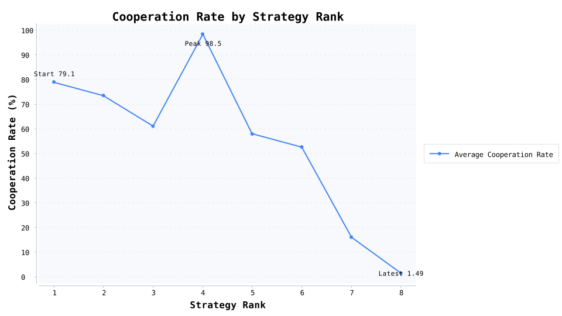

# 噪声派对锦标赛：宽容策略如何赢下 96 人囚徒困境

### 爆款开场：误操作频发的团队还能撑住合作吗？

想象一场 96 人的跨部门协作大会：语音延迟、按钮误触、消息误读——平均 1.5% 的动作都会被“噪声”翻转。谁能在这样的高压环境里带队冲破囚徒困境？这篇稿件给你现成答案。

### 为什么读者会停下滑动

- 现实共鸣：远程协作、开源项目、联盟营销每天都在随机匹配新的搭子。

- 情绪冲突：宽容者居然能打败永远合作的老好人？数据会颠覆直觉。

- 传播价值：结尾提供团队治理模板，适合配图扩散到管理、社科号。

### 实验怎么搭，才能讲得有说服力

- 对局：每场 200 轮重复囚徒困境，支付矩阵 R=3 / T=5 / P=1 / S=0，保证“犯错成本”远高于“守序收益”。

- 参赛阵容：8 种性格（从永远合作到严厉惩罚者）各派 12 人，总计 96 名角色，随机重排 30 轮，让每个人都遇到足够多的陌生队友。

- 噪声机制：1.5% 的动作被强制翻转，模拟误操作、会议延迟或情绪失控，逼策略设计“容错恢复”方案。

### 数据剧情：冠军凭什么赢、谁又跌出局

- TOP 1 宽容版以牙还牙#2（宽容版以牙还牙）：场均每轮 2.719 分，合作率 87.8%，互惠率 78.7%，最好/最差场次 601.00 / 152.00。

- TOP 2 永远合作#10（永远合作）：场均每轮 2.600 分，合作率 98.8%，互惠率 84.9%，最好/最差场次 598.00 / 12.00。

- TOP 3 随机触发以牙还牙#6（随机触发以牙还牙）：场均每轮 2.576 分，合作率 81.2%，互惠率 72.0%，最好/最差场次 608.00 / 156.00。

- 冠军比亚军场均多拿 23.77 分，合作率低于 11.0 个百分点——宽容版以牙还牙虽然没那么“乖”，却用迅速修复赢下长期收益。

- 垫底提醒：永远背叛#9（永远背叛）场均只拿 263.50 分，合作率 1.5%，几乎成了他人警示录。

### 阵营风向：整队复制就能用的策略模版

- 冠军阵营 宽容版以牙还牙：每轮平均 2.385 分，合作率 79.1%，互惠率 66.8%，标准差 180.57，适合作为“默认协作协议”。

- 末位阵营 永远背叛：合作率只有 1.5%，说明“只惩罚不复原”的套路在噪声环境里最容易崩，适合写成失败案例。

### 将数字转成读者关心的意义

- 总平均合作率 55.1%，告诉我们“信任＋可追责＋快速修复”是随机团队的最低配置。

- 宽容型冠军 宽容版以牙还牙 提供了完整的节奏：先给善意、发现背刺立刻反击、随后抛橄榄枝。

- 平均互惠率 44.0%，比单向合作更重要——适合引出团队复盘、OKR 共建或“周四检讨会”这些组织场景。

### 写稿小贴士（直接复制到排版里）

- 开头抛“误操作率 1.5% 挤爆协作”这句冲突，再嵌入冠军 vs. 亚军得分图，读者立刻代入。

- 中段用垫底角色做反面人物，穿插一则真实职场翻车案例，形成情绪共鸣。

- 结尾用“平均互惠率 44.0% 说明对话机制比单向善意更重要”收束，顺带引导读者留言分享处理冲突的经验。

- 想要多稿拆分？冠军策略写成正面案例、永远背叛写成避坑指南，再加一篇管理者操作手册即可。

