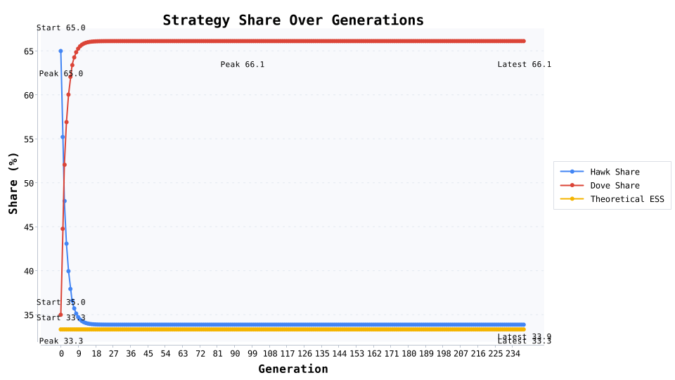
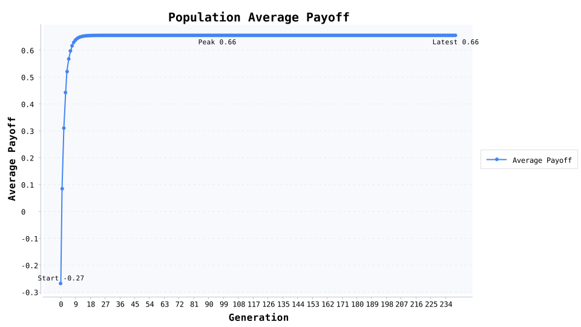
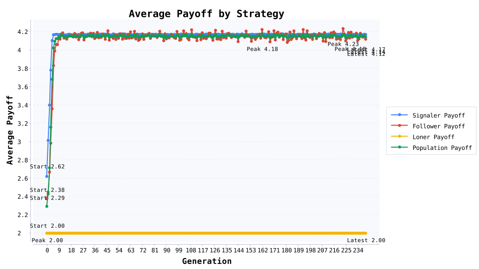
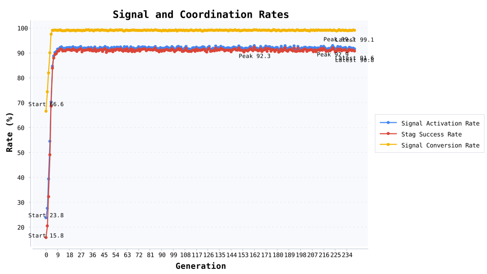

# 演化合作爆款素材库

这是一键跑完五个演化实验后的“公众号素材套餐”：直接带上数据、图表与写作提示，帮你从家庭互助讲到价格战、公共物品与协调破局。

使用方法很简单：每段保留核心叙事，挑选适合的图表，就能组合成一篇爆款潜质文章或多篇专题稿。

## 噪声派对锦标赛：宽容策略如何赢下 96 人囚徒困境

> 来源：协同进化锦标赛

### 爆款开场：误操作频发的团队还能撑住合作吗？

想象一场 96 人的跨部门协作大会：语音延迟、按钮误触、消息误读——平均 1.5% 的动作都会被“噪声”翻转。谁能在这样的高压环境里带队冲破囚徒困境？这篇稿件给你现成答案。

### 为什么读者会停下滑动

- 现实共鸣：远程协作、开源项目、联盟营销每天都在随机匹配新的搭子。

- 情绪冲突：宽容者居然能打败永远合作的老好人？数据会颠覆直觉。

- 传播价值：结尾提供团队治理模板，适合配图扩散到管理、社科号。

### 实验怎么搭，才能讲得有说服力

- 对局：每场 200 轮重复囚徒困境，支付矩阵 R=3 / T=5 / P=1 / S=0，保证“犯错成本”远高于“守序收益”。

- 参赛阵容：8 种性格（从永远合作到严厉惩罚者）各派 12 人，总计 96 名角色，随机重排 30 轮，让每个人都遇到足够多的陌生队友。

- 噪声机制：1.5% 的动作被强制翻转，模拟误操作、会议延迟或情绪失控，逼策略设计“容错恢复”方案。

### 数据剧情：冠军凭什么赢、谁又跌出局

- TOP 1 宽容版以牙还牙#2（宽容版以牙还牙）：场均每轮 2.719 分，合作率 87.8%，互惠率 78.7%，最好/最差场次 601.00 / 152.00。

- TOP 2 永远合作#10（永远合作）：场均每轮 2.600 分，合作率 98.8%，互惠率 84.9%，最好/最差场次 598.00 / 12.00。

- TOP 3 随机触发以牙还牙#6（随机触发以牙还牙）：场均每轮 2.576 分，合作率 81.2%，互惠率 72.0%，最好/最差场次 608.00 / 156.00。

- 冠军比亚军场均多拿 23.77 分，合作率低于 11.0 个百分点——宽容版以牙还牙虽然没那么“乖”，却用迅速修复赢下长期收益。

- 垫底提醒：永远背叛#9（永远背叛）场均只拿 263.50 分，合作率 1.5%，几乎成了他人警示录。

### 阵营风向：整队复制就能用的策略模版

- 冠军阵营 宽容版以牙还牙：每轮平均 2.385 分，合作率 79.1%，互惠率 66.8%，标准差 180.57，适合作为“默认协作协议”。

- 末位阵营 永远背叛：合作率只有 1.5%，说明“只惩罚不复原”的套路在噪声环境里最容易崩，适合写成失败案例。

### 将数字转成读者关心的意义

- 总平均合作率 55.1%，告诉我们“信任＋可追责＋快速修复”是随机团队的最低配置。

- 宽容型冠军 宽容版以牙还牙 提供了完整的节奏：先给善意、发现背刺立刻反击、随后抛橄榄枝。

- 平均互惠率 44.0%，比单向合作更重要——适合引出团队复盘、OKR 共建或“周四检讨会”这些组织场景。

### 写稿小贴士（直接复制到排版里）

- 开头抛“误操作率 1.5% 挤爆协作”这句冲突，再嵌入冠军 vs. 亚军得分图，读者立刻代入。

- 中段用垫底角色做反面人物，穿插一则真实职场翻车案例，形成情绪共鸣。

- 结尾用“平均互惠率 44.0% 说明对话机制比单向善意更重要”收束，顺带引导读者留言分享处理冲突的经验。

- 想要多稿拆分？冠军策略写成正面案例、永远背叛写成避坑指南，再加一篇管理者操作手册即可。

## 亲缘选择：1000 代演化揭开家庭互助的底层逻辑

> 来源：亲缘选择实验

### 爆款开场：谁在家庭危机里冲在最前？

我们把 6000 个亲属丢进一台演化引擎，让他们在 999 代里反复选择“要不要为家人买单”。结果证明：被叫作“老好人”的人，真的有数据撑腰。

### 现实痛点切入点

- 养老、育儿、疾病互助中，总是那几个亲人顶上，凭什么？

- 想鼓励社区互助，需要证据告诉大家：先付出真的划算。

- 公益、品牌想讲“先吃亏后获利”的故事，这里有现成素材。

### 仿真舞台怎么搭，才经得起追问

- 家庭切分：6 人一户，共 1000 户，亲缘相关系数 r=0.50（近似亲兄弟姐妹）。

- 收益对比：利他收益 B=2.4、成本 C=0.8，让 rB=1.2 > C=0.8，满足汉密尔顿法则。

- 演化设定：按包容适合度抽样繁殖，突变率 0.02，产出 1000 代日志，可直接转成三张曲线图。

### 数据剧情三段式

- 起始利他者占比 24.1% → 第 999 代 98.1%，第 4 代首次跨过 90%，展示“爱心爆发”戏剧化转折。

- 利他者直接适合度劣势 0.45，却靠包容适合度优势 1.65 扭转命运：短期吃亏、长期回本的量化证据。

- 日志每 10 代输出一次，对应策略占比/包容适合度/直接适合度三张图，剧本式呈现“坚持与回报”。

### 把数据翻译成读者会点赞的洞察

- 家庭或社区互助不是情怀，而是“关系强度 × 回流收益”真的大于投入。

- 政策层面可用社区积分、互助保险、税收抵扣提升“关系强度”，把模型搬进现实。

- 企业文化若打造“亲属感”，等同于复制包容适合度机制，让关键员工享受团队复利。

### 写稿与排版提示

- 用“24.1%→98.1%”的占比曲线开篇，再补上“包容适合度领先 1.65”这个转折， 拉高情绪张力。

- 中段穿插一个真实的家庭或社区故事，映射数据里的“先垫付后回流”。

- 结尾抛出“我们能否设计出让陌生人也愿意互助的制度？”鼓励读者留言。

## 价格战越打越穷：鹰鸽模型的混合均衡警报

> 来源：鹰鸽冲突实验

价格战为什么总是“赢了面子亏了钱”？我们让资源价值 V=2.0、冲突成本 C=6.0 的鹰鸽模型跑了 240 代，记录混合均衡如何自动出现。

### 爆款开头：价格战打到骨折，谁先喊停？

把一场资源价值只有 2.0，却要付出 6.0 冲突成本的价格战放进演化模型，让“鹰派 vs 鸽派”的真实动态自己跑出来。只要你在电商、地产、MCN 或职场竞争里被内卷过，这段数据就能戳中你。

### 读者痛点切入

- 促销大战越打越亏，到底什么时候该停？

- 团队内部竞争升级，如何避免“鱼死网破”？

- 企业想做“让利”宣传，可否拿到可视化证据？

### 仿真舞台搭建细节

- 初始态：鹰派 65.0%、鸽派 35.0%，复制强度 0.45，突变率 0.01，保留少量随机扰动防止陷入死局。

- 成本结构：资源价值 V=2.0 vs 冲突成本 C=6.0，理论均衡鹰派占比 33.3%，让“赢家也可能输光”成为必然。

- 输出：241 代数据（占比、策略收益、群体收益），方便制作折线、双轴或瀑布图。

### 数据高潮三连击

- 鹰派占比 65.0% → 第 240 代 33.9%，鸽派升至 66.1%，精准贴合理论均衡。

- 群体平均收益从 -0.27 回到 0.66，说明“暂停内耗”能迅速让组织回血。

- 第 8 代 进入“±2%”均衡窗口，混合策略正式成为演化稳定解，可做成“价格战停火时间线”。

### 给操盘手和管理者的提醒

- 当冲突成本 6.0 大于收益 2.0，“两败俱伤”不再是形容词：鹰派互殴平均只剩 -2.00。

- 组织需要保留 66.7% 左右的鸽派缓冲区，他们是停战与谈判的“安全阀”。

- 留下约 1% 的策略突变空间，可以类比为“预留缓冲资金/试点团队”，防止集体冲向毁灭。

### 写稿与传播提示

- 开头用“价格战均衡点=V/C”配数据图，瞬间把抽象理论说成人话。

- 用“第 8 代回到正收益”做情绪拐点，配上企业案例或职场故事，增强代入感。

- 结尾把行业案例（直播带货、房产促销、红包大战）与模型对照，加一句“你们行业的均衡点是多少？”引导留言。

## 公共物品：一个退出按钮压住搭便车

> 来源：公共物品博弈实验

当社区服务没人愿意干，我们给公共物品博弈加一个“退出按钮”：旁观者拿固定收益，看 250 代复制器演化能否压住搭便车。

### 爆款开头：给社区服务加一个“退出键”，合作率反而更稳？

我们在一个 5 人小组的公共物品博弈里，给参与者增加“随时退出拿保底收益”的选项。结果显示：只要退出机制设计得当，搭便车会自己缩回去。这套剧情非常适合写社区治理、志愿服务或企业文化案例。

### 痛点排序，引导共鸣

- 社区活动靠少数热心人撑，其他人旁观甚至搭便车。

- 企业在内部协作中想推“保底奖励”，担心反而削弱合作。

- 政策号、公益号需要“柔性治理”与“退出机制”的实证案例。

### 仿真舞台：确保读者听得懂也信得过

- 参数设定：公共乘数 r=3.0，合作者成本 1.0，旁观者保底收益 1.2。

- 起跑线：合作者 50.0%、搭便车者 35.0%、旁观者 15.0%；复制强度 0.45，突变率 0.015。

- 仿真规模：共 250 代、每代 8000 次随机匹配，随机种子 2026，确保别人复现得到同样结果。

### 数据高潮：三条曲线讲完故事

- 平均收益 1.18 → 1.20，说明退出机制没有摧毁整体回报，反而更稳定。

- 合作者稳住在 31.2%，旁观者攀升到 48.9%，搭便车者被压到 19.9%，形成“合作—旁观”双引擎。

- 第 16 代 让搭便车跌破 20%；合作峰值出现在第 0 代（50.0%），适合作为图文的情绪拐点。

### 把数字翻成现实建议

- 搭便车者收益 1.19 被保底收益 1.2“锁死”，退出选项比高压惩罚更快见效，可类比“社区记点”“志愿时薪”。

- 合作者最终仍拿到 1.22 的群体收益，证明“愿意出力的人”享受到更大整体蛋糕，不会被退出机制伤害。

- 旁观者稳定在 40%~50%，是“软治理”里的安全垫：提供保底，不让群体瞬间崩盘。

### 写稿与排版提示

- 用“退出按钮居然能压住搭便车？”做开头悬念，配三线图，读者立刻代入社区故事。

- 用“第 16 代 让搭便车跌破 20%”当金句，顺势切到制度设计或政策提案。

- 结尾提示参数可调，鼓励读者留言分享自己参与的志愿服务或积分制度案例。

## 鹿猎信号：12% 破局者把团队拖进高配局

> 来源：鹿猎信号协调实验

“只有 12% 的人敢先站出来发信号，却把整支队伍的收益拉到了新高度。”这是我们在鹿猎博弈里加入“信号者”角色后跑出的爆款叙事。

### 切入爆点：信号越吵，协作越稳

我们模拟一个鹿猎博弈团队：240 代演化、每代 7500 次随机双人组队。信号者会付出 0.8 成本先喊话，跟随者只在看到信号后才押注“猎鹿”，保守者永远猎兔。

### 开局数据：12% 喊话者能撑住吗？

- 初始构成：信号者 12.0%、跟随者 58.0%、保守者 30.0%；选择强度 0.72，突变率 0.018。

- 鹿猎收益 5.0，对赌失败掉到 0.0；猎兔稳稳 2.0。信号者每次喊话额外付出 0.8。

### 故事走向：一波信号带出整支队伍

- 第 3 代开始，信号者份额突破 25%，团队的“敢赌基因”被点燃。

- 鹿猎协作的峰值出现在第 162 代，成功率高达 92.3%；同期信号触发占比 92.9%。

- 信号转化率在第 0 代冲破 60%，意味着“喊话就会有人跟”的拐点已经到来。

- 最终一代：信号者 71.3%、跟随者 28.1%、保守者仅剩 0.6%，人均收益从 2.29 飙到 4.14。

### 爆款写作提示：用“信号成本”解释现实痛点

- 群聊里总有几位“自来熟”提前确认流程，他们就是现实中的信号者。

- 引用“第 3 代信号突破 25%”当作情绪节点，引导受众理解“先发声的人，不一定赚最多，但绝对握有节奏权”。

- 对比最终收益与保守策略的差距，延伸到企业跨部门协作、校园社团破冰、志愿活动召集等场景。

### 金句素材池

- “91.6% 的信号触发率，把鹿猎项目从低配协同拉进高配执行。”

- “信号者牺牲 0.8 的成本，换来团队 4.14 的长尾收益——这是组织行为学里的 ROI。”

- “当信号成功率冲上 99.1%，保守者不再是主流——你可以放心把这段故事写进公众号开头。”

### 互动话题

- 引导读者留言：你的团队里谁是那个“先喊开始的人”？他/她得到怎样的回报？

- 追加彩蛋：把初始信号者比例调到 5% 再跑一次，做成留言互动的读者作业。

