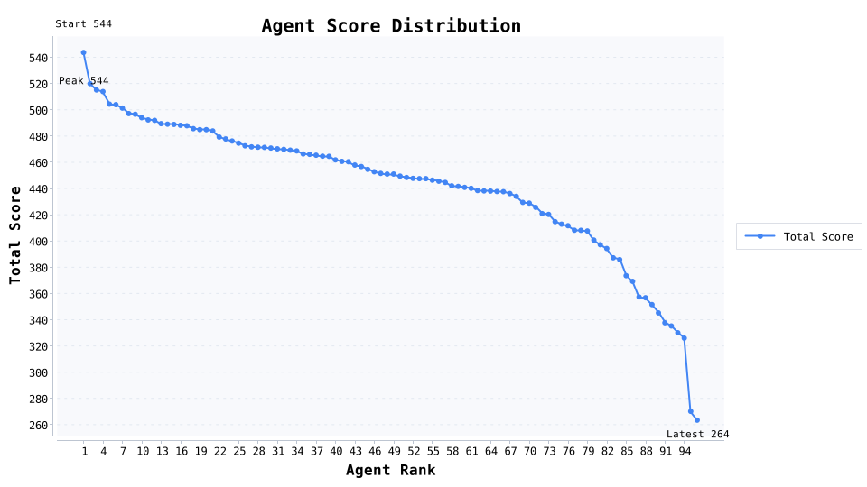
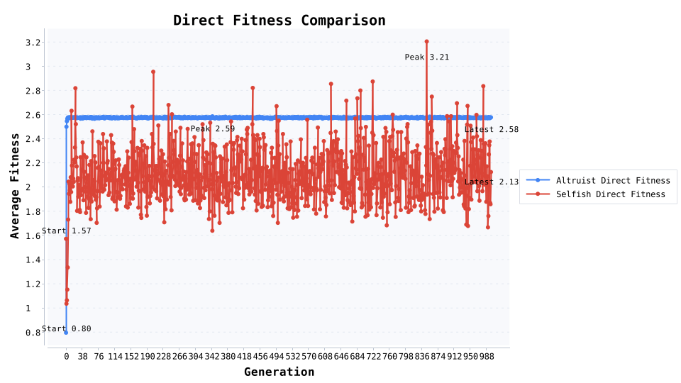
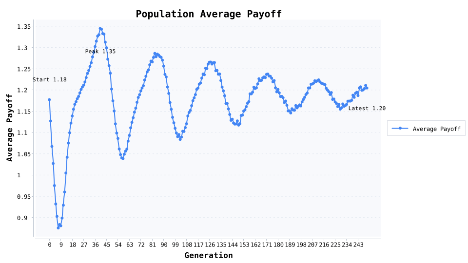

# 演化合作爆款素材库

这是一键跑完四个演化实验后的“公众号素材套餐”：直接带上数据、图表与写作提示，帮你从家庭互助讲到价格战和公共物品。

使用方法很简单：每段保留核心叙事，挑选适合的图表，就能组合成一篇爆款潜质文章或多篇专题稿。

## 噪声派对锦标赛：宽容策略如何赢下 96 人囚徒困境

> 来源：协同进化锦标赛

96 位策略选手在含 1.5% 噪声的随机派对里混战，我们想看谁能在误操作频发的现实世界守住合作。

### 随机派对的底层规则

- 重复囚徒困境每场进行 200 轮，支付矩阵 R=3 / T=5 / P=1 / S=0。

- 8 种性格（永远合作、宽容/怀疑版以牙还牙、严厉惩罚者等）各派 12 人，总计 96 名角色，随机重排 30 轮。

- 噪声 1.5% 会把动作翻转，逼着参赛者设计容错和恢复流程。

### 冠军榜：谁能在噪声里稳住合作

- TOP 1 宽容版以牙还牙#2（宽容版以牙还牙）：场均每轮 2.719 分，合作率 87.8%，互惠率 78.7%，最好/最差场次 601.00 / 152.00。

- TOP 2 永远合作#10（永远合作）：场均每轮 2.600 分，合作率 98.8%，互惠率 84.9%，最好/最差场次 598.00 / 12.00。

- TOP 3 随机触发以牙还牙#6（随机触发以牙还牙）：场均每轮 2.576 分，合作率 81.2%，互惠率 72.0%，最好/最差场次 608.00 / 156.00。

- 冠军比亚军场均多拿 23.77 分、合作率高出 -11.0 个百分点，是“先友善→立刻惩罚→快速复原”的最佳注脚。

- 垫底提醒：永远背叛#9（永远背叛）场均只拿 263.50 分，合作率 1.5%，几乎成了他人警示录。

### 策略阵营风向

- 冠军阵营 宽容版以牙还牙：每轮平均 2.385 分，合作率 79.1%，互惠率 66.8%，标准差 180.57。

- 末位阵营 永远背叛：合作率只有 1.5%，说明“只惩罚不复原”的套路在噪声环境里最容易崩。

### 三个现实启示

- 总平均合作率 55.1%，说明只要允许快速修复，合作就能在随机搭子里坐稳半壁江山。

- 宽容型冠军 宽容版以牙还牙 把“犯错后给台阶”写进流程，是团队制度里最值得抄的玩法。

- 平均互惠率 44.0%，比单纯的合作率更能打，告诉我们“对话机制”比“单向善意”重要得多。

### 写稿小贴士

- 用“冠军比亚军多拿多少分”开场，再贴前 3 名的柱状图，读者会立刻代入“职场策略赛”。

- 把 1.5% 噪声翻译成“误操作率”，辅以真实案例，能自然过渡到团队容错话题。

- 结尾抛出“平均互惠率 44.0%”这句金句，就能把伦理讨论拉回机制设计。

## 亲缘选择：1000 代演化揭开家庭互助的底层逻辑

> 来源：亲缘选择实验

为什么每次家庭群聊出事，永远是长辈冲在最前？我们把 6000 个个体放进 999 代的演化实验里，让数据告诉你“亲缘互助”背后的收益账。

### 仿真怎么搭

- 家庭结构：6 人一户，共 1000 户，亲缘相关系数 r=0.50。

- 利他收益与成本：B=2.4、C=0.8，让 rB=1.2 > C=0.8。

- 繁殖规则：按包容适合度抽样，突变率 0.02，累计记录 1000 代演化日志。

### 三个关键数据瞬间

- 起始利他者占比 24.1% → 第 999 代 98.1%，第 4 代首次跨过 90% 门槛。

- 利他者直接适合度劣势 0.45，但包容适合度优势 1.65，让“吃亏”转化为生存优势。

- 每 10 代输出一次日志，对应三张折线图：策略占比、包容适合度、直接适合度，一目了然。

### 可以抛给读者的现实启示

- 家庭或社区互助不是情怀，而是“关系强度 × 回流收益”真的大于投入。

- 想在政策里激活互助，积分、信誉、税收抵扣都能放大“r”。

- 企业文化里营造“亲属感”，本质是在复制让贡献者拿到团队复利。

### 写稿时的素材提示

- 用“24.1%→98.1%”的占比曲线开篇，再补上“包容适合度领先 1.65”的数据，故事张力瞬间拉满。

## 价格战越打越穷：鹰鸽模型的混合均衡警报

> 来源：鹰鸽冲突实验

价格战为什么总是“赢了面子亏了钱”？我们让资源价值 V=2.0、冲突成本 C=6.0 的鹰鸽模型跑了 240 代，记录混合均衡如何自动出现。

### 模型参数一眼读懂

- 初始占比：鹰派 65.0%、鸽派 35.0%，复制强度 0.45，突变率 0.01。

- 冲突成本 C=6.0 远高于资源价值 V=2.0，理论均衡鹰派占比约 33.3%。

- 仿真输出 241 代数据，包含鹰派/鸽派占比、策略收益与群体平均收益。

### 三个关键节点

- 鹰派占比 65.0% → 第 240 代 33.9%，鸽派相应升至 66.1%，几乎贴近理论值。

- 群体平均收益从 -0.27 回升到 0.66，说明自损型冲突被快速纠偏。

- 第 8 代 进入“±2%”均衡窗口，混合策略成为演化稳定解。

### 给管理者的三条提醒

- 当冲突成本 6.0 大于收益 2.0，两败俱伤不是比喻，而是公式：鹰派对鹰派平均只剩 -2.00。

- 想把团队从内耗里拽出来，就要安排人成为“鸽派缓冲区”，让占比逼近 66.7%。

- 留一点突变（约 1%）机制，能防止组织陷入单一激进态，适合写成“预留缓冲账户”的比喻。

### 写稿小贴士

- 先抛“价格战均衡点=V/C”这个公式，再贴鹰派占比折线，一句话就能解释企业为何需要停战。

- 用“第 8 代回到正收益”作为情绪拐点，引导读者思考停止内耗的时间窗口。

- 结尾把模型代入行业案例（直播带货、房产促销），数据就不再是抽象数学。

## 公共物品：一个退出按钮压住搭便车

> 来源：公共物品博弈实验

当社区服务没人愿意干，我们给公共物品博弈加一个“退出按钮”：旁观者拿固定收益，看 250 代复制器演化能否压住搭便车。

### 实验参数亮点

- 小组规模 5 人，公共乘数 r=3.0，合作者成本 1.0，旁观者保底收益 1.2。

- 初始占比：合作者 50.0%、搭便车者 35.0%、旁观者 15.0%；复制强度 0.45，突变率 0.02。

- 共运行 250 代、每代 8000 次随机匹配，种子 2026 保证结果可复现。

### 数据转折点

- 平均收益 1.18 → 1.20，证明退出机制没有拖累整体回报。

- 合作者稳态 31.2%、旁观者抬升到 48.9%，搭便车者被压到 19.9%。

- 第 16 代 让搭便车比例跌破 20%；合作峰值出现在第 0 代（50.0%）。

### 三条现实启示

- 搭便车者收益 1.19 被旁观者的保底 1.2 挤压，退出选项比高压惩罚更快见效。

- 合作者最终仍拿到 1.22 的群体收益，说明“愿意出力的人”不会被退出机制伤害。

- 旁观者维持在约一半，是“软治理”里可复用的缓冲层：提供保底，不让群体崩盘。

### 写稿小贴士

- 先讲“给公共项目一个退出键”，再贴合作者/搭便车/旁观者三线图，读者会自动代入社区案例。

- 用“第 16 代 让搭便车跌破 20%”作为金句过渡到制度设计，故事自然顺滑。

- 结尾提示：参数都能改，换成志愿服务或会员积分场景，文章立刻可复用。

