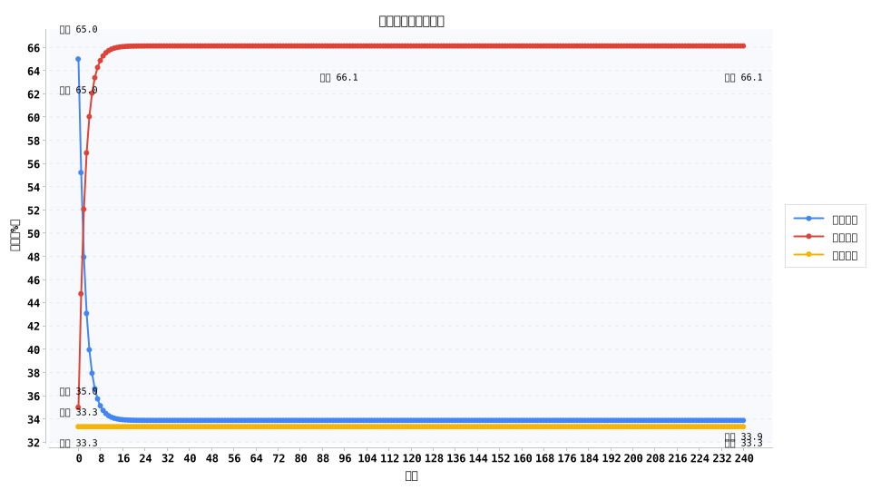
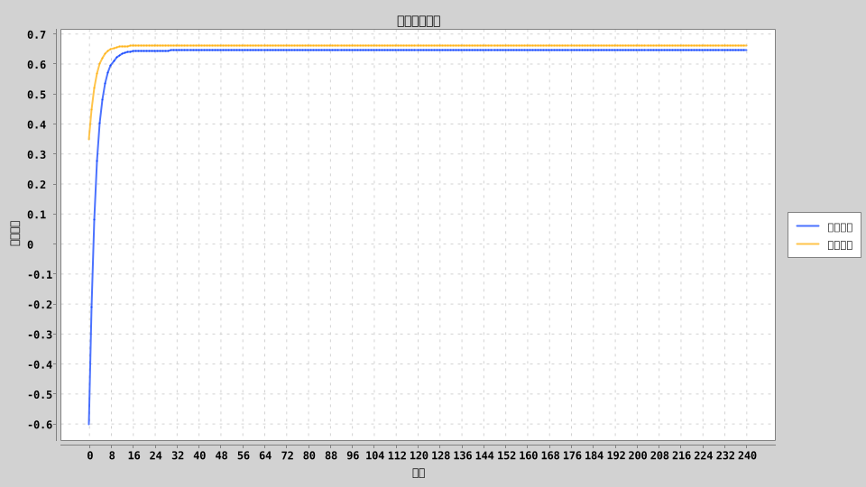
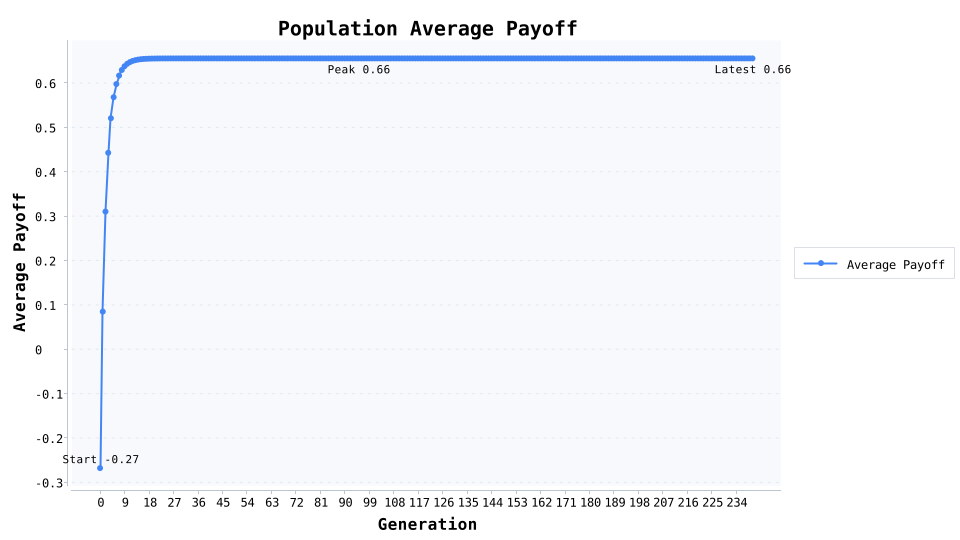

# 鹰鸽冲突演化：混合均衡为何能在 8 代内救回组织收益

当资源价值只有 2.0、冲突成本高达 6.0 时，演化模型显示：鹰派比例会从起始的 65.0% 在 240 代内收敛到 33.9%，鸽派上升到 66.1%，群体平均收益从 -0.27 回到 0.66。换句话说，持续的“硬碰硬”必然把人拖向负收益，适度保留谈判者才能守住整体效率。

## 实验设置
- **初始状态**：鹰派 65.0%、鸽派 35.0%；复制强度 0.45，突变率 0.01。
- **收益结构**：资源价值 \(V = 2.0\)，冲突成本 \(C = 6.0\)，理论混合均衡的鹰派比例为 \(V/C ≈ 33.3\%\)。
- **演化流程**：240 代演化，每代记录策略占比、策略收益、群体平均收益，便于观察收敛速度与波动范围。
- **关键指标**：首次进入“±2%”均衡窗口发生在第 8 代；鹰派内部对决平均收益 -2.00，远低于与鸽派互动的 +2.00。

## 核心发现
- **鹰派迅速退潮**：仅 8 代就落入均衡区间，说明高冲突成本会在极短时间内淘汰纯冲突策略。
- **整体收益恢复**：平均收益 -0.27 → 0.66，表明减少内耗能迅速让组织回血。
- **策略多样性必要**：1% 的突变率保证系统始终保留少量“探路者”，防止在环境变化时完全失灵。

## 演化机制解读
1. **成本压倒收益**：当 \(C > V\)，鹰派之间的冲突让双方都变成输家，复制概率自然下降。
2. **鸽派提供缓冲**：高比例鸽派为组织留住谈判与协商的空间，减少资源耗散。
3. **动态混合均衡**：小幅突变确保系统在环境稍有变化时仍可重新寻找均衡，而非陷入僵化状态。

## 现实案例：网约车补贴大战的止损
2014—2016 年，中国网约车行业经历大规模补贴大战。滴滴和 Uber 中国为了争夺市场份额频繁推出“低价券 + 司机奖励”，短期内吸引了大量用户，但双方一年内烧掉数十亿美元，司机补贴被迅速抬升。补贴成本远超单次出行的价值，与模型中的“冲突成本 > 资源收益”高度吻合。最终双方在 2016 年 8 月选择合并，换取更具可持续性的混合策略：价格回归理性、补贴收缩、更多资源投入到安全与运力调度上。这一现实案例说明，在高成本竞争中主动引入“停火机制”，能帮助组织回到正收益的均衡。

## 行动建议
- **行业竞争者**：在冲突成本明显高于收益时，应主动设定补贴上限或协商通道，避免陷入“你死我也亏”的局面。
- **企业内部管理**：对内卷型 KPI 竞争设置缓冲规则，如共享资源池或阶段性协作任务，确保团队中始终保留“鸽派”角色。
- **政策制定者**：对容易出现价格战的行业（车企补贴、直播带货等），可通过监管或行业自律组织引导各方回到混合策略。

## 写作与排版提示
- 开篇引用“65.0% → 33.9%”的鹰派变化，与“平均收益 -0.27 → 0.66”组合呈现直观对比。
- 在数据段落中说明“第 8 代进入均衡窗口”意味着什么，强化“反内耗要趁早”的信息。
- 使用网约车补贴大战作为现实案例，引导读者思考所在行业的冲突成本与均衡点。

