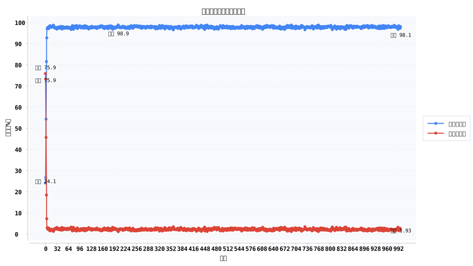
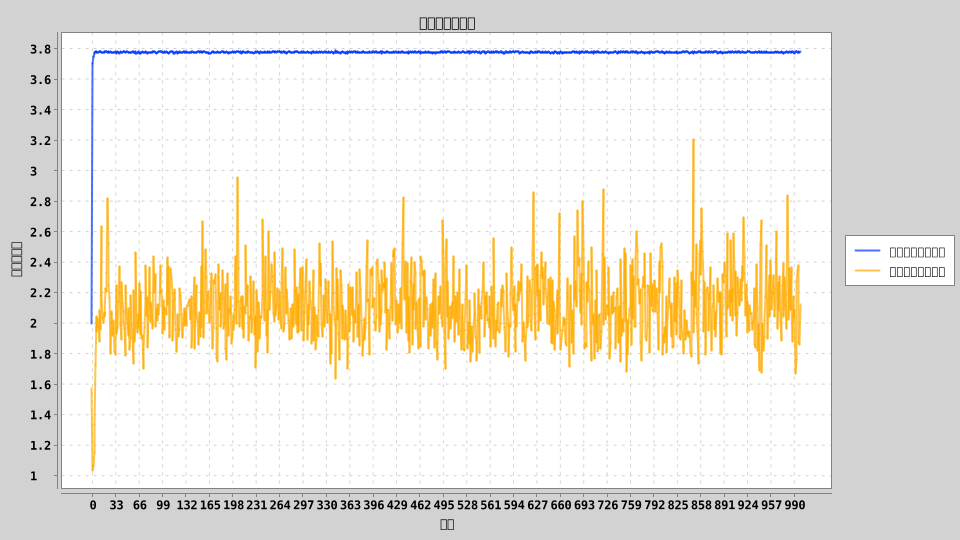
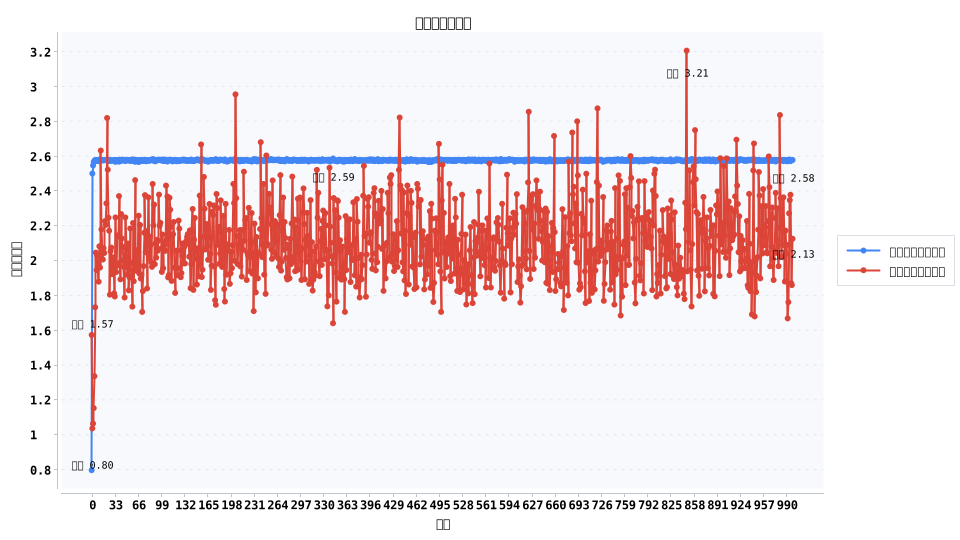

# 亲缘选择演化：包容适合度如何驱动 98.1% 的长期互助

在 6 人家庭、999 代演化的亲缘选择模型里，利他策略从起始的 24.1% 迅速扩张到第 4 代突破 90%，第 999 代稳定在 98.1%。尽管利他者的直接适合度始终低 0.45，他们凭借包容适合度领先 1.65 的优势，让“为家人先付出”在长期演化中获得压倒性胜利。

## 实验设置
- **总体结构**：1000 个家庭，每户 6 人；亲缘相关系数 \(r = 0.50\) 对应亲兄弟姐妹的血缘关系。
- **收益参数**：利他行为成本 \(C = 0.8\)，受益方收益 \(B = 2.4\)，满足汉密尔顿法则 \(rB = 1.2 > C\)。
- **演化机制**：按照包容适合度进行繁殖抽样，突变率 0.02，防止陷入单一策略；记录 1000 代的策略占比与适合度指标。
- **输出指标**：策略占比、直接适合度、包容适合度三张时间序列图，可直接用于可视化。

## 核心发现
- **利他策略的爆发式扩张**：利他者占比 24.1%→98.1%，自私者几乎被淘汰；第 4 代就跨过 90%，合作拐点非常早。
- **短期吃亏、长期回本**：利他者的直接适合度低于自私者 0.45，但包容适合度高出 1.65，长期收益覆盖成本。
- **系统稳定性**：在 1000 代中没有出现大幅震荡，说明只要血缘关系和收益结构成立，利他行为会迅速成为演化稳定策略。

## 演化机制解读
1. **血缘放大效应**：相关系数 0.50 让“帮别人”有 50% 的概率折算成“帮自己”。当收益远大于成本，策略更新自然偏向利他。
2. **包容适合度是关键衡量标准**：直接适合度看似吃亏，但加上亲缘权重后利他策略整体的遗传贡献更高。
3. **突变维持灵活性**：2% 的突变率避免陷入完全同质的“利他—利他”状态，使系统对参数调整保持敏感，可用于后续对比实验。

## 现实案例：日本“互助券”时间银行
1990 年代起，日本民间组织推广 “Fureai Kippu（ふれあい切符）” 时间银行，志愿者为社区老人提供照护可累积积分，自己或亲属未来可兑换服务。该制度把“亲缘关系”转化为“可转移的互助积分”，等价于放大 \(rB\) 项，鼓励先付出、后回流。政策研究显示，长期参与者更愿意在亲友遇到照护危机时主动支援，与模型中利他策略的快速扩张高度一致。

## 行动建议
- **照护场景**：把亲缘或社区纽带显性化，例如时间银行、互助储蓄账户，让“先出力”拥有可见的回报管道。
- **政策设计**：通过税收抵扣、公共积分或互助保险，提高 \(r\) 或 \(B\)，把演化模型转化为现实激励。
- **企业文化**：营造“愿意互相补位”的团队氛围，将信息、培训等公共资源的回流机制设计清楚，复制包容适合度效应。

## 写作与排版提示
- 开头直接使用“24.1%→98.1%”与“包容适合度领先 1.65”吸引读者，再配策略占比图强调转折。
- 在数据段落中采用“指标 + 含义”句式，例如“第 4 代跨过 90%，意味着利他行为几乎一夜之间成为主流”。
- 结合时间银行案例，说明如何把模型参数映射到现实制度，增强文章的可信度与可操作性。

