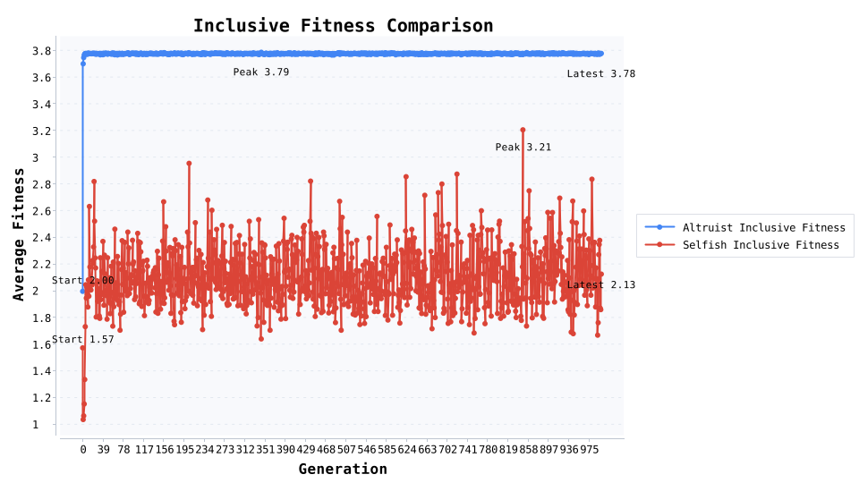

# 亲缘选择：汉密尔顿法则的数值验证

实验设定：将 6000 个个体划分为 6 人一组的亲缘家庭，亲缘相关系数 r=0.50，利他收益 B=2.4，利他成本 C=0.8，使得 rB=1.2 大于 C=0.8。

结果摘要：起始利他者占比 24.1%，到第 999 代提升至 98.1%，第一次突破 90% 出现在 第 4 代；利他者直接适合度相对劣势 0.45，但包容适合度优势 1.65。

解读要点：

· 家庭结构让利他收益在亲属之间扩散，亲缘折扣后的收益依旧超过个人成本。

· 包容适合度被用于生殖抽样，利他策略在短期内就能占据主导。

· 每 10 代的日志可直接转换成折线图，用以展示利他策略的扩张轨迹。

