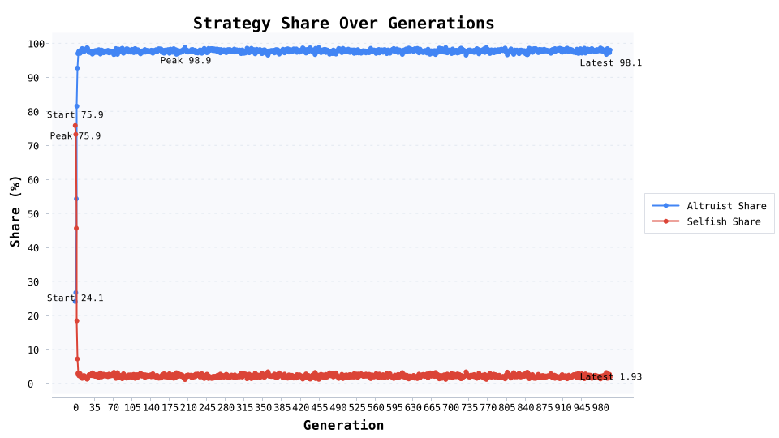

# 亲缘选择：1000 代演化揭开家庭互助的底层逻辑

为什么每次家庭群聊出事，永远是长辈冲在最前？我们把 6000 个个体放进 999 代的演化实验里，让数据告诉你“亲缘互助”背后的收益账。

### 仿真怎么搭

- 家庭结构：6 人一户，共 1000 户，亲缘相关系数 r=0.50。

- 利他收益与成本：B=2.4、C=0.8，让 rB=1.2 > C=0.8。

- 繁殖规则：按包容适合度抽样，突变率 0.02，累计记录 1000 代演化日志。

### 三个关键数据瞬间

- 起始利他者占比 24.1% → 第 999 代 98.1%，第 4 代首次跨过 90% 门槛。

- 利他者直接适合度劣势 0.45，但包容适合度优势 1.65，让“吃亏”转化为生存优势。

- 每 10 代输出一次日志，对应三张折线图：策略占比、包容适合度、直接适合度，一目了然。

### 可以抛给读者的现实启示

- 家庭或社区互助不是情怀，而是“关系强度 × 回流收益”真的大于投入。

- 想在政策里激活互助，积分、信誉、税收抵扣都能放大“r”。

- 企业文化里营造“亲属感”，本质是在复制让贡献者拿到团队复利。

### 写稿时的素材提示

- 用“24.1%→98.1%”的占比曲线开篇，再补上“包容适合度领先 1.65”的数据，故事张力瞬间拉满。

