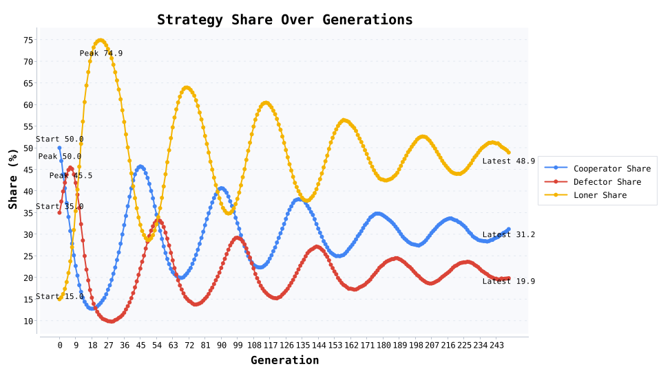
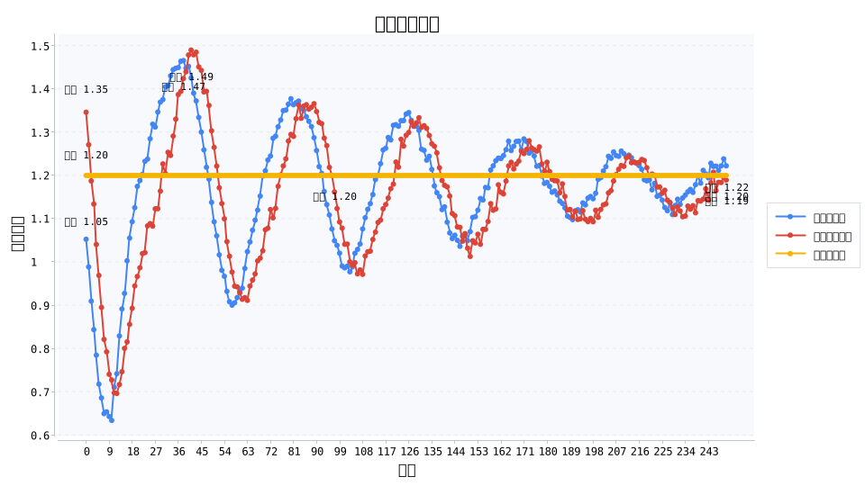
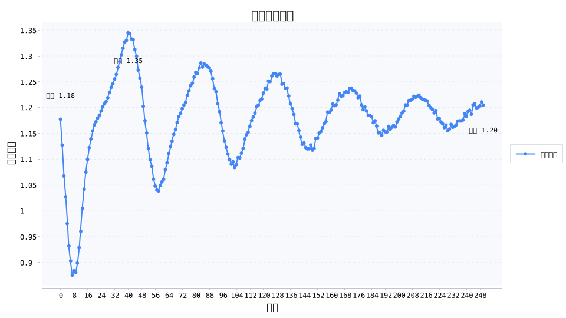

# 公共物品演化：退出选项如何压住 19.9% 的搭便车

在 5 人公共物品博弈里加入“退出拿保底收益”后，搭便车者的比例在 250 代内从 35.0% 降到 19.9%，合作者稳定在 31.2%，旁观者占比升至 48.9%。平均收益从 1.18 稳定抬升到 1.20，说明柔性退出机制既守住合作底线，又避免过度惩罚带来的反噬。

## 实验设置
- **角色构成**：合作者 50.0%、搭便车者 35.0%、旁观者 15.0%；复制强度 0.45，突变率 0.015。
- **收益结构**：合作者投入 1.0 单位，公共乘数 \(r = 3.0\)；旁观者可直接领取 1.2 的保底收益。
- **演化流程**：250 代演化，每代 8000 次随机匹配，记录策略占比、策略收益与群体平均收益。
- **关键输出**：策略占比折线、策略收益比较、群体收益走势，便于讲述“退出键”带来的三重变化。

## 核心发现
- **搭便车被保底收益“锁死”**：1.2 的退出收益让搭便车策略优势消失，比例降至 19.9%，并在第 16 代跌破 20%。
- **合作者维持正收益**：最终合作者平均收益 1.22，高于群体平均值，证明“继续投入”仍有长期回报。
- **旁观者成为缓冲层**：旁观者稳定在 40%–50%，承担“有人累了可以先歇一歇”的缓冲功能，防止合作体系瞬间瓦解。

## 演化机制解读
1. **退出选项提高基线收益**：旁观者收益 1.2 将搭便车的收益空间压缩，迫使其无法持续复制。
2. **合作与退出形成双引擎**：当部分人暂时退出，仍保留重新合作的可能，整体合作率依旧维持在 31.2%。
3. **柔性治理优于硬惩罚**：无须高额惩罚或强制约束，只要提供明确的保底通道并记录表现，就能让系统在波动中保持稳定。

## 现实案例：北京“回天有我”志愿者的保底机制
北京昌平区的“回天有我”志愿服务行动自 2019 年起推行“能量币”制度，志愿者参与社区服务可累积积分，用于兑换生活服务或在紧急时刻优先获得帮助。更关键的是，志愿者可在忙碌时期申请暂停而保留既得积分，重新回归时无需重新审核。这种“可退出但不清零”的安排，与模型中的旁观者保底收益一致：既缓冲了志愿者的疲劳，也让长期合作维持在稳定水平。

## 行动建议
- **社区治理**：设计“可暂停、可复归”的志愿者制度，把退出流程透明化，让居民敢于先上场。
- **企业内部协作**：为项目组成员设置“阶段性退出”的替补机制，例如轮岗池、积分或培训券，避免核心成员被消耗殆尽。
- **公共政策**：在垃圾分类、治安巡逻等公共事务中，结合保底奖励与行为记录，替代“罚款优先”的高压治理。

## 写作与排版提示
- 以“搭便车从 35.0% → 19.9%”开篇，配策略占比图突出转折点。
- 在数据段落中解释“1.2 的保底收益意味着什么”，强调退出机制如何改变激励。
- 结合“回天有我”案例，展示柔性治理的成效，并在结尾邀请读者分享各自社区的“退出键”设计。

