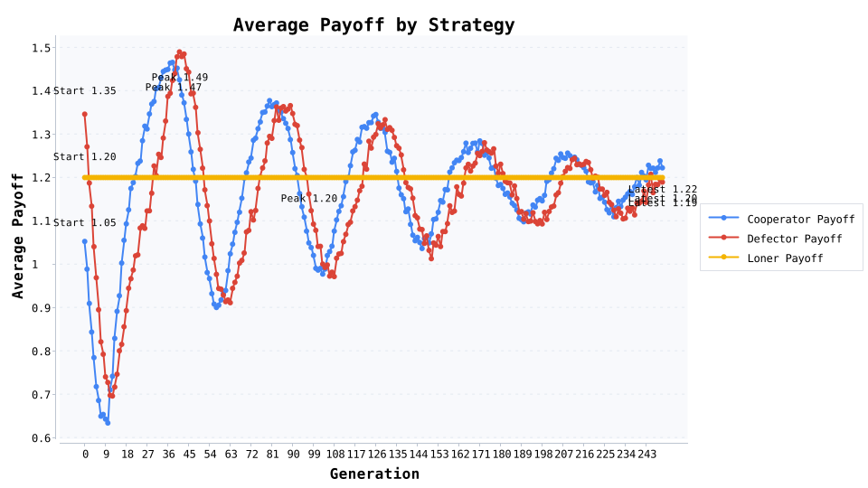

# 公共物品：一个退出按钮压住搭便车

当社区服务没人愿意干，我们给公共物品博弈加一个“退出按钮”：旁观者拿固定收益，看 250 代复制器演化能否压住搭便车。

### 实验参数亮点

- 小组规模 5 人，公共乘数 r=3.0，合作者成本 1.0，旁观者保底收益 1.2。

- 初始占比：合作者 50.0%、搭便车者 35.0%、旁观者 15.0%；复制强度 0.45，突变率 0.02。

- 共运行 250 代、每代 8000 次随机匹配，种子 2026 保证结果可复现。

### 数据转折点

- 平均收益 1.18 → 1.20，证明退出机制没有拖累整体回报。

- 合作者稳态 31.2%、旁观者抬升到 48.9%，搭便车者被压到 19.9%。

- 第 16 代 让搭便车比例跌破 20%；合作峰值出现在第 0 代（50.0%）。

### 三条现实启示

- 搭便车者收益 1.19 被旁观者的保底 1.2 挤压，退出选项比高压惩罚更快见效。

- 合作者最终仍拿到 1.22 的群体收益，说明“愿意出力的人”不会被退出机制伤害。

- 旁观者维持在约一半，是“软治理”里可复用的缓冲层：提供保底，不让群体崩盘。

### 写稿小贴士

- 先讲“给公共项目一个退出键”，再贴合作者/搭便车/旁观者三线图，读者会自动代入社区案例。

- 用“第 16 代 让搭便车跌破 20%”作为金句过渡到制度设计，故事自然顺滑。

- 结尾提示：参数都能改，换成志愿服务或会员积分场景，文章立刻可复用。

