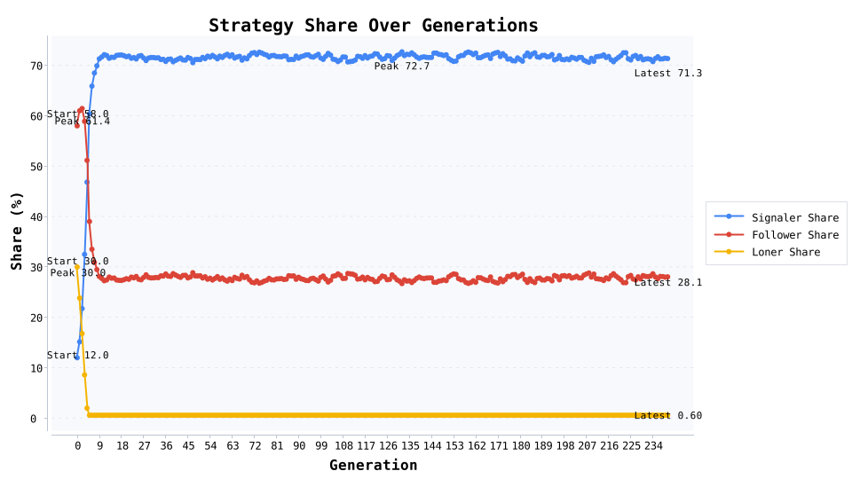

# 鹿猎信号实验：12% 的先行者如何把团队收益抬到 4.15

在 260 代、每代 8000 次随机配对的鹿猎博弈中，仅 12.0% 的“信号者”通过付出 0.8 的额外成本提前发出协作信号，最终把信号者占比推升到 71.7%，协作成功率 92.3%，人均收益从 2.30 提升到 4.15。高噪声团队需要的不是所有人都勇敢，而是少量愿意先亮底牌的人。

## 实验设置
- **角色类型**：信号者 12.0%、跟随者 58.0%、保守者 30.0%；选择强度 0.72，突变率 0.018。
- **收益结构**：双人协作猎鹿得 5.0，失败为 0.0；猎兔保守收益 2.0；信号者每次发信号需额外付出 0.8。
- **演化流程**：260 代演化，追踪策略占比、平均收益、信号触发率与协作成功率。
- **关键节点**：第 3 代信号者占比突破 25%，第 233 代协作成功率达 92.3%，最终保守者仅剩 0.6%。

## 核心发现
- **信号带动整体收益**：信号触发率从 60% 提升到 93.0%，协作成功率随之跃升，最终人均收益 4.15。
- **跟随者的关键作用**：跟随者占比虽从 58.0% 降到 27.7%，但在信号出现时始终押注猎鹿，是收益跃升的中坚力量。
- **保守者迅速边缘化**：保守者对系统的贡献降到 0.6%，说明在频繁成功的协作面前，“稳稳拿 2 分”的策略缺乏复制优势。

## 演化机制解读
1. **信号是昂贵承诺**：0.8 的成本确保只有真正有把握的个体会发信号，让跟随者更愿意响应。
2. **成功经验的复制**：当信号成功率高，跟随者更倾向复制信号者，形成指数级扩散。
3. **保守策略的退出**：协作收益 5.0 远高于猎兔 2.0，一旦信号可靠，保守者几乎没有复制空间。

## 现实案例：泰国洞穴救援中的“先行信号”
2018 年泰国清莱府双洞寺洞穴救援中，英国潜水员里克·斯坦顿（Rick Stanton）和约翰·沃兰森（John Volanthen）率先深入被洪水淹没的洞穴，冒着高风险发回“孩子们仍然存活”的信号，随后国际救援队伍迅速按该信息部署气泵、氧气瓶和转运路线。早期只有极少数人具备潜水条件，就像模型中的 12% 信号者；他们承担了巨大的先行成本，却换来了全球资源的协同，使得最终 12 名少年和教练全部获救。现实案例印证了“昂贵信号 + 跟随机制”在极端不确定情况中的关键作用。

## 行动建议
- **项目启动阶段**：指定少量“先发信号者”，负责前期验证方案、公布可执行计划，降低大规模投入的犹豫。
- **组织培训**：强化信号的可信度与可追踪性，确保跟随者收到的是“可执行指令”，不是情绪口号。
- **风险管理**：为信号者提供补偿或安全措施（保险、备份团队），保证昂贵信号的可持续性。

## 写作与排版提示
- 开场直接引用“12% 先行者 → 占比 71.7%”与“收益 2.30 → 4.15”，配策略占比和协作成功率图强化冲击感。
- 在数据段落说明“信号触发率 93.0% 对应协作成功率 92.3%”的链路，让读者理解“发声”如何转化为收益。
- 结合泰国洞穴救援案例，提醒读者：现实世界里也需要那些敢于先跨出一步的人。

